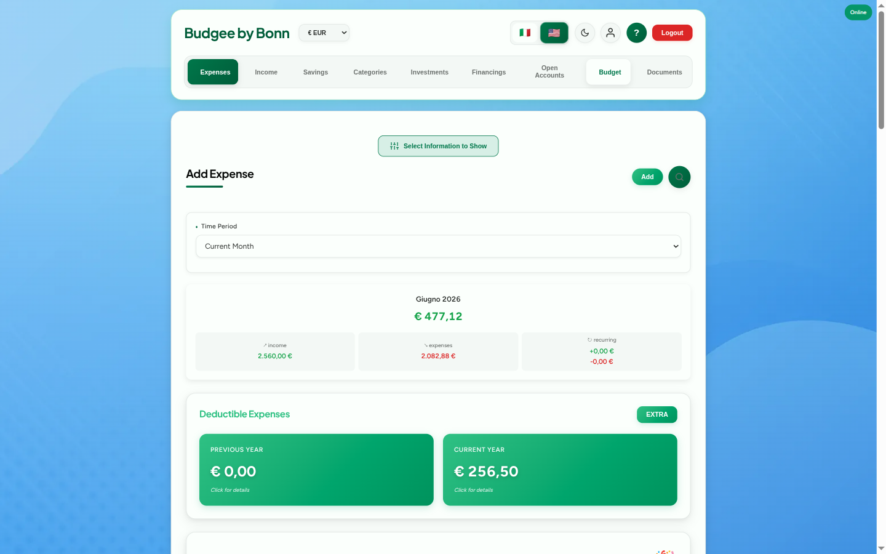
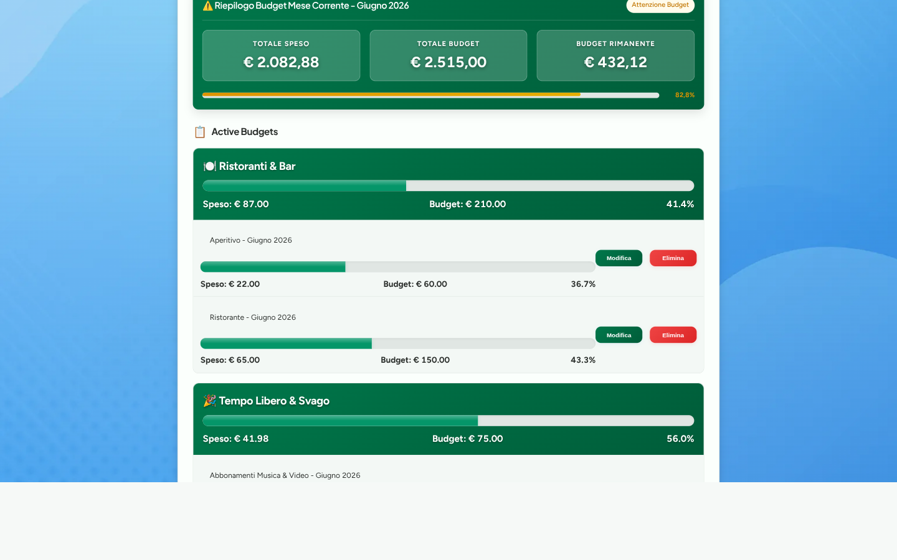
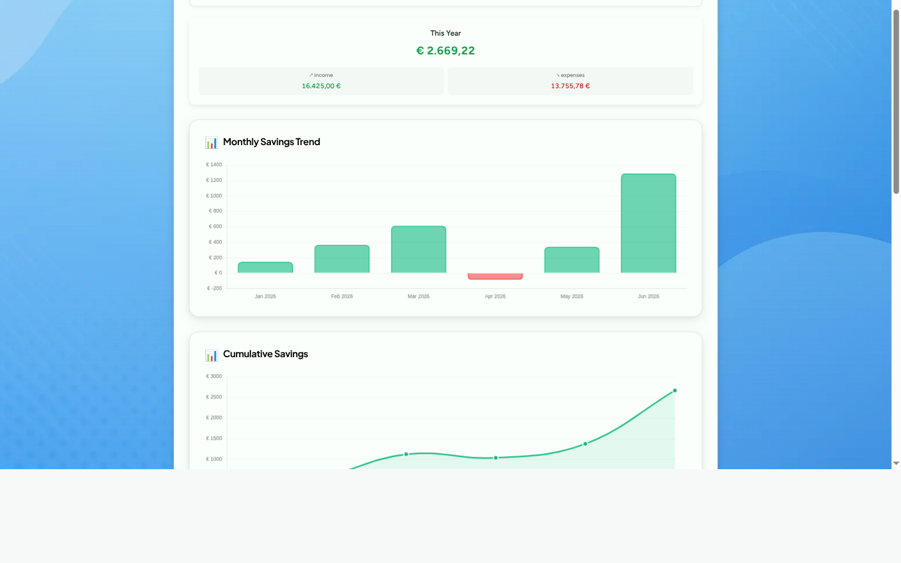
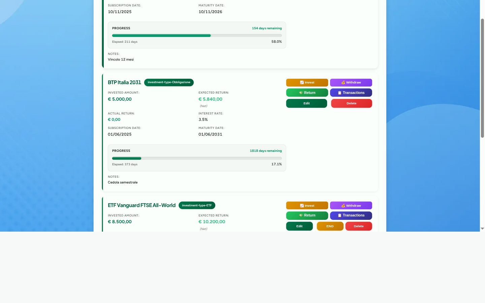
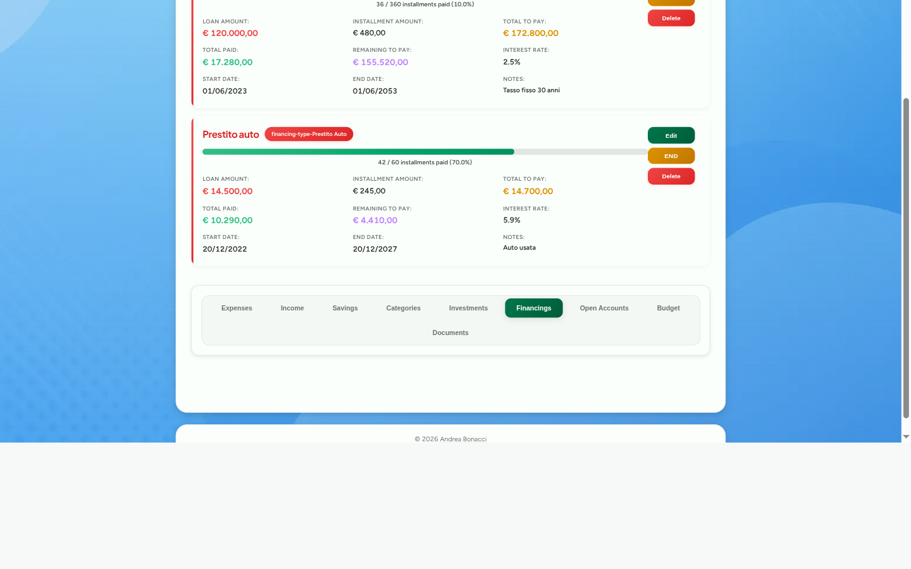
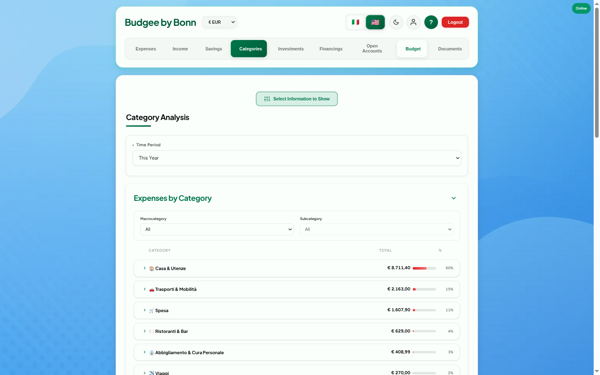
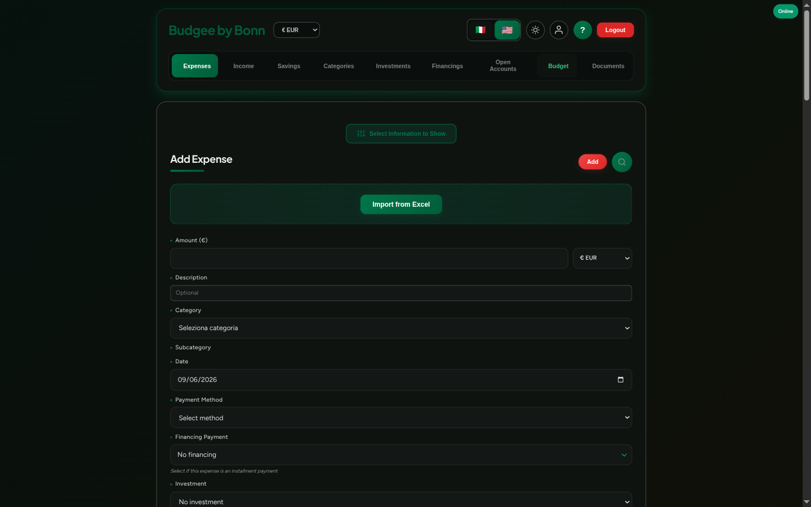
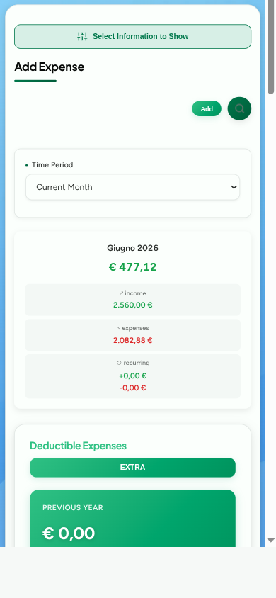
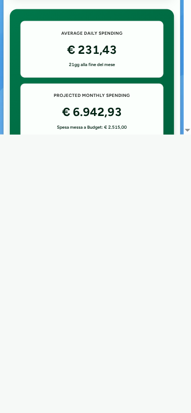

# 💰 Budgee — Personal Finance Manager

**Take control of your finances, stress-free**

🌐 [**Open the App**](https://financial-management-by-bonn.web.app) &nbsp;•&nbsp; 📱 Installable &nbsp;•&nbsp; ☁️ Cloud Sync &nbsp;•&nbsp; 🆓 Free

---

## 💡 What is Budgee

Budgee is a comprehensive Progressive Web App (PWA) for personal finance management. Track expenses and income, set budgets, manage investments and loans, organize financial documents, and achieve your savings goals — all in one place, accessible from any device with real-time cloud synchronization.

It's not a spreadsheet. It's not a complicated tool. It's built for people who want complete control over their finances without the complexity.

*Monthly overview: income, expenses, savings rate and deductible totals at a glance.*

---

## 🎯 Why Budgee

- **Complete financial management** — expenses, income, budgets, investments, loans, open accounts, savings goals, tax-deductible expenses, and documents in a single app
- **Free, forever** — no subscription, no hidden premium tier, no ads
- **Works everywhere** — smartphone, tablet, desktop; installable as a native app (PWA) on your home screen
- **Your data, always available** — secure cloud sync with Firebase across all your devices
- **Works offline too** — record transactions even without an internet connection; everything syncs automatically when you're back online
- **Ready in 2 minutes** — create an account and start right away, no complex setup needed
- **Smart insights** — automatic analysis of your spending patterns with actionable suggestions
- **Multi-currency support** — manage finances in EUR, USD, GBP, and PLN with automatic conversion

---

## 🚀 Getting Started

### 1. Open the app

Go to [financial-management-by-bonn.web.app](https://financial-management-by-bonn.web.app) from any browser — Chrome, Safari, Firefox, Edge.

### 2. Create your account

Tap **Register** and enter your email and a password. You'll receive a verification email — click the link to activate your account. That's it.

### 3. Install on your device (optional)

On mobile, your browser will suggest "Add to Home Screen". Accept, and Budgee will appear as a native app with its own icon. On desktop, look for the install icon in the address bar.

### 4. Add your first transactions

You're in! Start by adding a few expenses or income entries from this month. Each transaction needs an amount, a category, and a date.

### 5. Set your budgets

Go to the **Budget** tab and set spending limits for the categories you want to monitor. Budgee will track your progress in real time.

---

## 📋 How to Use Budgee

### 💸 Expenses & Income

The core of the app. Record every transaction with:
- **Amount** and **currency** (EUR, USD, GBP, PLN supported)
- **Category** — choose from predefined hierarchical categories or create your own
- **Subcategories** — organize expenses with detailed subcategories
- **Description** — optional notes for context
- **Date** and **payment method** (cash, digital, bank transfer, crypto, direct debit, check)
- **Link to loans** — associate expense payments with financing installments
- **Link to investments** — track capital contributions to your investments
- **Tax-deductible flag** — mark expenses as deductible for tax purposes
- **Recurring transactions** — automate repeating expenses and income (daily, weekly, monthly, yearly)

You can also:
- **Import from Excel** — upload an `.xlsx` file to add transactions in bulk
- **Export to CSV** — download your data for external use or backup
- **Advanced search** — find any transaction by date range, category, amount, keyword, payment method, or linked item
- **Real-time statistics** — daily average, month-end projection, highest spending day
- **Interactive charts** — monthly trends, weekly/monthly/yearly patterns, category distribution

*Daily heatmap calendar highlights your highest-spending days; the monthly trend chart shows how your spending evolves day after day.*

### 🎯 Budget

Set a monthly spending limit for each category. Budgee shows you:
- How much you've spent vs. your limit (with visual progress bars)
- A forecast of your total spending by end of month
- **Copy last month's budget** in one click — no need to re-enter limits every month

Budget categories support a hierarchy with macro-categories and sub-categories, so you can track spending at the level of detail you prefer.

*Hierarchical budgets per macro and sub-category, with real-time progress bars and overspending alerts.*

### 📊 Savings

A dedicated section that calculates your savings automatically from your income and expenses:
- **Monthly trend chart** — see how your savings evolve over time
- **Cumulative savings** — track your total savings growth
- **Saving rate** — what percentage of your income you're actually saving
- **Best and worst months** — understand your patterns at a glance
- **Automatic insights** — Budgee detects patterns and gives you tips

*Monthly savings trend with year-to-date totals and saving rate.*

### 📈 Investments

Track your entire portfolio in one place:
- **Asset types**: bonds, deposit accounts, stocks, mutual funds, ETFs, cryptocurrencies, real estate, and more
- **Detailed tracking**: invested amount, subscription date, interest rate, maturity date, expected gross/net returns, actual returns, custom notes
- **Progress visualization**: time-based progress bars showing time elapsed until maturity
- **Income linking**: automatically connect dividends, interest, or rental income to specific investments
- **Capital tracking**: link expense payments to track additional capital contributions
- **Summary statistics**: total invested, total expected returns, total actual returns, average interest rate, next maturity date
- **Advanced search**: find investments quickly with multiple filters

*Each asset card shows invested amount, expected return, interest rate, maturity progress and quick actions for capital movements.*

### 💳 Loans & Financing

Manage all your debts with complete tracking:
- **Types**: home mortgages, car loans, personal loans, student loans, phone financing, degree redemption, and more
- **Detailed information**: loan amount, start/end dates, total installments, installment amount, interest rate, installments paid, total paid, remaining balance, custom notes
- **Progress visualization**: visual progress bars showing payment completion percentage
- **Expense linking**: automatically connect installment payments to track paid amounts
- **Payment management**: enter paid installments or total amount paid
- **Summary statistics**: total borrowed, total to pay (with interest), total already paid, total remaining, average monthly installment, average progress
- **Advanced search**: find loans quickly with multiple filters
- **Detailed modal**: view complete loan information with payment history and amortization schedule

*Mortgages and loans with installment progress, total paid, remaining balance and interest rate.*

### 📁 Documents

Seamless Google Drive integration for financial document management:
- **27+ predefined folders**: payslips, invoices (received/paid), tax-deductible expenses, medical reports, investment documents, loan documents, contracts, insurance, tax documents, warranties, bank statements, credit cards, bills and utilities, taxes and tributes, real estate, vehicles, pension, donations, education expenses, cryptocurrencies, condo fees, legal expenses, veterinary expenses, average balances, and miscellaneous
- **Automatic year organization**: folders automatically organized by year (2024, 2025, etc.)
- **Customizable view**: choose which folders to display based on your needs
- **Direct access**: quick links to open folders directly in Google Drive
- **Secure OAuth 2.0**: safe authentication without sharing passwords
- **Multi-language**: folder names automatically translated based on your language preference
- **Cloud sync**: preferences saved and synchronized across devices

### 🔄 Recurring Transactions

Complete automation system for repeating expenses and income:
- **Flexible frequencies**: daily, weekly (choose day of week), monthly (first day, last day, or specific day), yearly
- **Manual confirmation**: each occurrence requires confirmation before recording — full control over what gets added
- **Complete management**: modify amount, description, and payment method; delete single occurrences or all future ones; view confirmation history
- **Smart notifications**: elegant modals for a premium experience
- **Cloud synchronization**: recurring transactions saved to Firestore and synced across devices
- **Examples**: rent, salary, subscriptions, utility bills, insurance premiums, loan installments

### 🤖 Insights & Reports

Budgee analyzes your data and presents it visually:
- **Calendar heatmap** — see your spending intensity for each day of the month
- **Sankey diagram** — visualize where your money flows across categories
- **Cumulative trend charts** — track expenses, income, and savings over time
- **Pattern detection** — automatic identification of spending patterns and anomalies
- **Comparative analysis** — compare current period with previous periods
- **Optimization suggestions** — personalized recommendations based on your financial behavior
- **Advanced search** — filter by category, date range, amount range, keywords
- **Custom reports** — generate reports for any time period you choose with proportional budget calculations
- **Automatic insights** — patterns, anomalies, and suggestions based on your data

*Category analysis ranks your spending by macro-category with drill-down to sub-categories and percentage share.*

### 🏦 Open Accounts

Track credits and debits with individuals or businesses:
- **Account types**: track money you owe (debts) or money owed to you (credits)
- **Detailed information**: person/provider name, account type, initial amount, current balance, opening date, notes
- **Transaction history**: record payments made or received with dates and amounts
- **Status tracking**: accounts automatically marked as closed when balance reaches zero
- **Consolidated view**: see all accounts in a single list or separated by active/closed
- **Linked transactions**: view all payments and receipts associated with each account
- **Summary statistics**: total credits, total debts, net balance
- **Advanced search**: find accounts by name, type, amount range, or date
- **Export**: download account data to CSV for external analysis

### 🎯 Savings Goals

Set and track your financial objectives:
- **Goal types**: one-time goals with deadlines or ongoing savings targets
- **Detailed tracking**: target amount, saved amount, deadline, progress percentage
- **Visual progress**: color-coded progress bars and completion indicators
- **Smart allocation**: track how much of your liquid balance is allocated to goals
- **Goal management**: create, edit, archive, or delete goals as needed
- **Automatic calculations**: see how much you need to save monthly to reach your goal
- **Priority system**: organize goals by importance and deadline
- **Completion celebration**: visual feedback when goals are achieved
- **Historical tracking**: view archived goals and past achievements

### 📝 Tax-Deductible Expenses

Simplify tax season with dedicated deductible expense tracking:
- **Automatic flagging**: mark expenses as tax-deductible when recording them
- **Year-by-year view**: see deductible expenses organized by tax year
- **Current and previous year**: quick access to the two most relevant years
- **Historical data**: view deductible expenses from any past year
- **Extra deductibles**: add deductible expenses not tracked as regular expenses
- **Category breakdown**: see which categories contribute most to deductions
- **Total calculations**: automatic summation of deductible amounts per year
- **Export ready**: download deductible expenses for tax preparation
- **Recurring deductibles**: automatically mark recurring expenses as deductible
- **Investment contributions**: track deductible investment contributions

### 🌐 Multi-language Support

Budgee is available in **Italian** and **English**. Switch language at any time from the settings. All interface elements, categories, charts, statistics, and document folder names are automatically translated.

### 🎨 Theme Support

Choose between light and dark mode for comfortable viewing in any lighting condition. Your preference is saved and synced across devices.

<table>
<tr>
<td></td>
<td></td>
</tr>
<tr>
<td align="center"><em>Light mode</em></td>
<td align="center"><em>Dark mode</em></td>
</tr>
</table>

### 📱 Designed for Mobile

Budgee is mobile-first: every section adapts to small screens with a bottom-tab navigation and condensed layouts. Install it from your browser to launch it like a native app.

&nbsp;&nbsp;&nbsp;

### 📊 Interactive Tutorial

First-time users are guided through the app with an interactive tutorial that explains all major features and how to use them effectively.

---

## 🔐 Privacy & Security

Your financial data is sensitive. Budgee takes security seriously:

- **Your data stays yours** — each user can only access their own data, enforced at the database level
- **Encrypted in transit and at rest** — all connections use HTTPS; data stored with AES-256 encryption
- **Email verification required** — accounts must be verified before use
- **Strong password policy** — minimum 8 characters with uppercase, lowercase, and numbers
- **No tracking, no ads** — Budgee doesn't sell or share your data with anyone
- **Offline-safe** — data cached locally is synced securely when you reconnect

For a detailed overview of all security measures, see the [**Security Documentation**](./SECURITY.md).

---

## 🛠️ Under the Hood

Budgee is a Progressive Web App (PWA) built with modern web technologies:

| Component | Technology |
|-----------|-----------|
| **Frontend** | Vanilla JavaScript (ES6+ modules), HTML5, CSS3 with CSS custom properties |
| **Architecture** | Modular design with feature-based organization, event delegation, lifecycle management |
| **Charts** | Chart.js for interactive data visualization |
| **Backend** | Firebase (Firestore, Authentication, Cloud Functions, Hosting) |
| **Documents** | Google Drive API with OAuth 2.0 |
| **Notifications** | Telegram Bot API for alerts and reports |
| **Offline** | Service Worker with Network-First caching strategy |
| **Data Import/Export** | SheetJS (xlsx) for Excel, JSZip for compressed exports |
| **Security** | Content Security Policy, HTTPS enforcement, input sanitization, Firestore security rules |

---

## 🚀 Key Features Summary

✅ **Expense & Income Tracking** with categories, subcategories, and payment methods  
✅ **Budget Management** with real-time monitoring and alerts  
✅ **Savings Analysis** with automatic calculations and trend visualization  
✅ **Investment Portfolio** tracking with returns and maturity dates  
✅ **Loan Management** with payment tracking and progress visualization  
✅ **Open Accounts** for tracking credits and debts  
✅ **Savings Goals** with progress tracking and deadline management  
✅ **Tax-Deductible Expenses** organized by year  
✅ **Document Management** with Google Drive integration  
✅ **Recurring Transactions** with flexible scheduling  
✅ **Advanced Search** across all data types  
✅ **Smart Insights** with pattern detection and suggestions  
✅ **Multi-Currency** support (EUR, USD, GBP, PLN)  
✅ **Multi-Language** (Italian, English)  
✅ **Dark/Light Theme**  
✅ **Offline Mode** with automatic sync  
✅ **PWA** installable on all devices  
✅ **Excel Import/Export**  
✅ **Cloud Sync** across devices  
✅ **Interactive Tutorial**

---

## 📄 License

This project is proprietary. The web application is **free for personal use**. See [LICENSE](./LICENSE) for details.

---

## 💬 Feedback & Support

Have feedback, suggestions, or found a bug? I'd love to hear from you!

👉 **[Read the Feedback Guide](./FEEDBACK.md)** to learn how to:
- Report bugs effectively
- Request new features
- Share your experience
- Get support

**Quick contact:** andreabonacci95@protonmail.com

---

## 👤 Author

Built by **Andrea Bonacci** — [github.com/AndreaBonn](https://github.com/AndreaBonn)

---

*The source code is private, but the app is completely free to use.*

*If you found Budgee useful, consider leaving a ⭐ on this repository!*

**© 2025-2026 Andrea Bonacci**

