# Budgee - Personal Finance Manager

**Take control of your finances, stress-free**

[Open the app](https://financial-management-by-bonn.web.app) · [Read the user guide](./USER_GUIDE.md) · Installable as a PWA · Cloud-synced · Free

---

## What Budgee is

Budgee is a Progressive Web App (PWA) for personal finance. You track expenses and income, set monthly budgets, follow your investments and loans, store financial documents on Google Drive and set savings goals - from any device, with real-time cloud sync.

It was built for people who keep their finances in a notebook or a messy spreadsheet and want something easier without giving up on detail.

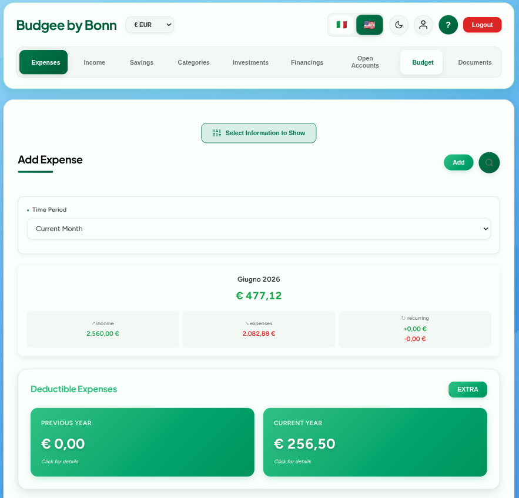

*Monthly overview: income, expenses, savings rate and deductible totals on a single page.*

---

## See it in action

A full walkthrough: login, expenses dashboard, adding an expense, income, savings, adding and cashing out an investment, and budgets.

---

## What you get

- Everything in one app: expenses, income, monthly budgets, investments, loans, open accounts, savings goals, deductible expenses and documents
- No subscription, no premium tier, no ads
- Runs on smartphone, tablet and desktop; you can install it from the browser and it behaves like a native app
- Cloud sync via Firebase, so the same data follows you across devices
- Works offline; anything you add without connection syncs back when you reconnect
- Quick to start: register and you are in
- Photograph a receipt and let the AI fill the form, if you want it and only after you say so
- Pattern detection on your spending, with practical suggestions
- A weekly backup on your own Google Drive, and a one-click export of the whole account
- A guided package of documents for your accountant at tax time
- Meal vouchers with a balance of their own, kept out of your liquidity because they cannot be spent everywhere
- Multi-currency: EUR, USD, GBP and PLN with automatic conversion

New here? The [user guide](./USER_GUIDE.md) walks through every section step by step.

---

## Getting started

### 1. Open the app

Go to [financial-management-by-bonn.web.app](https://financial-management-by-bonn.web.app) from any browser (Chrome, Safari, Firefox, Edge).

### 2. Create your account

Tap **Register**, type your email and a password. You will receive a verification email; click the link to activate the account.

### 3. Install on your device (optional)

On mobile, the browser will suggest "Add to Home Screen". Accept and Budgee will show up like a native app. On desktop, look for the install icon in the address bar.

### 4. Add your first transactions

Start by adding a few expenses or income entries from the current month. Each transaction needs an amount, a category and a date.

### 5. Set your budgets

Open the **Budget** tab and set spending limits for the categories you want to monitor. Budgee will track your progress in real time.

---

## How to use Budgee

### Expenses and income

The core of the app. For every transaction you can set:

- Amount and currency (EUR, USD, GBP, PLN)
- Category, chosen from hierarchical categories you can customise
- Subcategory for more detail
- A free-text description
- Date and payment method: cash, card or app, cheque, bank transfer, crypto, direct debit for expenses, voucher for income, meal voucher for both. The field is required when you fill the form by hand, and it comes pre-selected with the method you normally use for that category
- Link to a loan instalment or to an investment contribution
- Tax-deductible flag for end-of-year reporting
- Recurring frequency (daily, weekly, monthly, yearly)

Other things you can do:

- Import transactions from an `.xlsx` file in bulk, from the icon in the section header
- Export your data to CSV for backup or external use
- Find the currency you used last time already selected: every form keeps its own memory, so expenses can stay in zloty while your salary keeps arriving in euro
- Search across transactions by date, category, amount, keyword, payment method or linked item
- Read live statistics: daily average, projected month-end total, highest-spending day
- Open monthly, weekly and yearly trend charts and category distributions

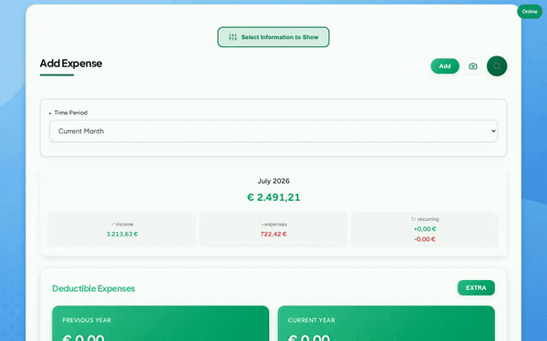

*The daily calendar uses colour intensity to mark the days with higher spending; the trend chart below shows how spending builds up day by day.*

### Scanning a receipt instead of typing it

The camera button next to the expense and income forms opens the AI scan: upload a photo or a PDF, and the amount, date, description and category land in the form already filled in. You check them and save, so nothing is written without you seeing it.

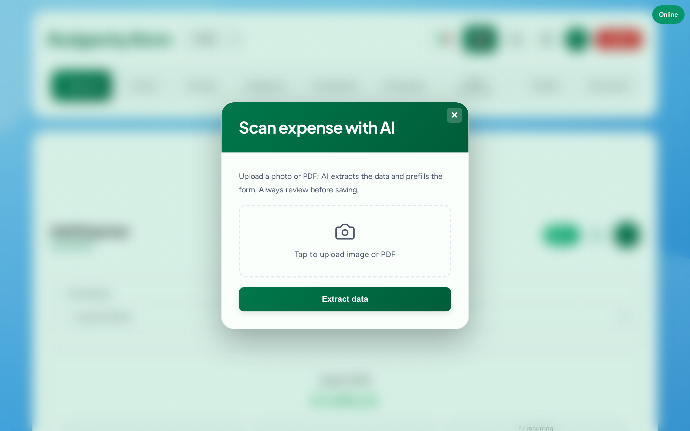

*Upload a photo or a PDF and the form comes back filled in. The last word is always yours.*

Three things are worth knowing before you use it:

- The scan runs on Google Gemini with an API key you enter yourself, in your profile. Without a key the feature stays off.
- The image leaves Budgee, so it asks for a separate consent the first time and you can withdraw it whenever you like, from the same screen.
- If you scan an invoice that looks like income while the expense form is open, Budgee stops and asks which of the two it is.

On a phone you can also share a photo straight from the gallery or the camera: Budgee shows up among the apps you can share to, and it opens on the scan with the image already loaded.

### Cash outflows

Cash is the part of a budget that is easiest to lose track of. The Expenses tab charts how much of your spending goes through it, month by month and category by category, and says out loud how much of the total is still unmeasured because the payment method is missing.

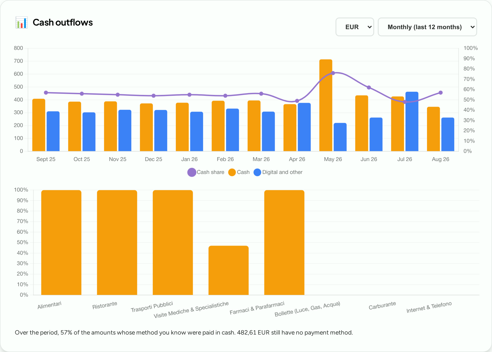

*The share is measured on amounts, not on the number of entries: ten coffees do not weigh as much as a rent payment.*

If your history predates the payment method field, your profile shows the coverage and offers to fill the gaps in bulk, one category at a time, suggesting the method you use most often for each.

### Meal vouchers

If you get them, you carry a second currency around: real money, but spendable only in certain places. Budgee treats them as what they are.

The "meal voucher" method works on income as well as on expenses, because a voucher is first received and then spent. You declare that you have them in your profile, set an opening balance with its date, and from there every movement paid in vouchers moves the counter. The balance sits at the top next to the currency selector, and on a line of its own inside the current balance card.

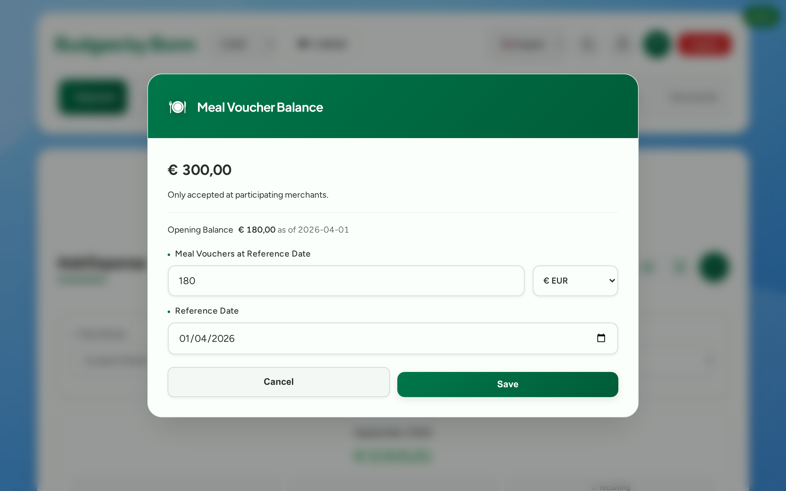

*The balance is derived from your movements starting at the figure you declared, so it cannot drift away from them. Until that figure exists the panel says so, rather than showing a zero that would look like data.*

What Budgee does not do is the decision that matters: meal vouchers stay out of your liquidity. Adding them in would claim that money is available for the rent. In period totals, budgets and savings they count like any other movement.

Turning the feature off hides it, it does not erase it. Past movements stay in the list with their label, and the opening balance stays written down, so turning it back on returns you to the point you started from.

### Budget

Set a monthly spending limit for each category. Budgee shows:

- How much you spent compared to the limit, with progress bars
- A forecast of where you are headed by the end of the month
- A one-click way to copy last month's budget, so you do not re-enter limits every month

Budget categories work in a hierarchy: macro-category first, then sub-categories. You decide how granular to go.

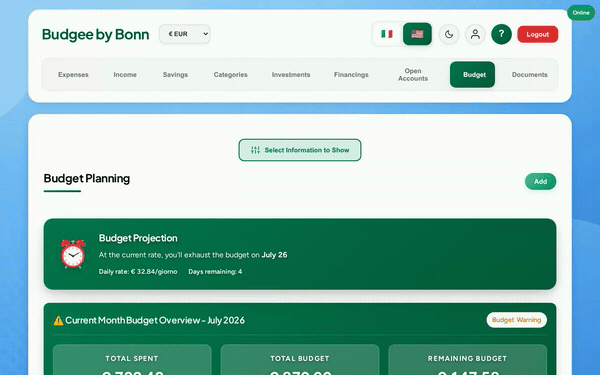

*Hierarchical budgets per macro and sub-category, with progress bars and alerts when you go over.*

### Savings

A dedicated section that derives your savings from income minus expenses:

- Monthly trend chart over time
- Cumulative savings line
- Saving rate (what fraction of your income you actually keep)
- Best and worst months at a glance
- Pattern detection with short suggestions

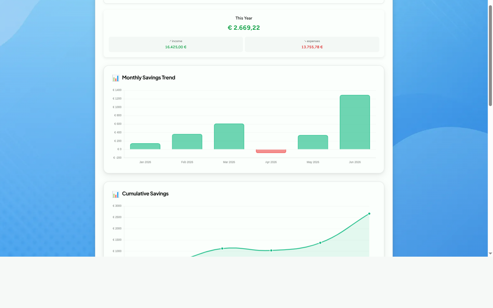

*Monthly savings trend with year-to-date totals and saving rate.*

### Investments

Your portfolio in one place:

- Asset types: bonds, deposit accounts, stocks, mutual funds, ETFs, cryptocurrencies, real estate and more
- Per-investment details: invested amount, subscription date, interest rate, maturity date, expected gross/net return, actual return, free-text notes
- Time-based progress bars on how much is left until maturity
- Link dividends, interest or rental income to the right investment
- Link expense payments to track additional capital contributions
- A movement history per investment: capital added, capital released, returns collected, each one editable or removable after the fact
- Recurring returns for what pays out on a schedule, such as a coupon or a rent
- Portfolio totals: invested capital, expected returns, actual returns, average interest rate, next maturity date
- Multi-filter search

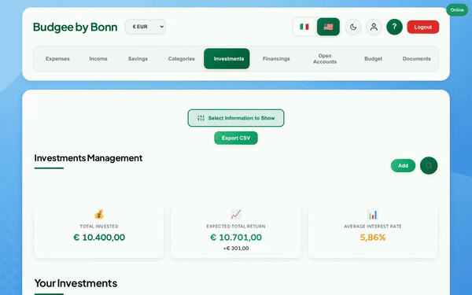

*Each card shows invested amount, expected return, interest rate, maturity progress and quick actions for capital movements.*

### Loans and financing

Track every form of debt:

- Types: home mortgages, car loans, personal loans, student loans, phone financing, degree redemption and more
- Per-loan details: loan amount, start and end dates, total instalments, instalment amount, interest rate, instalments paid so far, total paid, remaining balance, notes
- Progress bars on how close you are to closing the loan
- Link expense entries to instalments to track real payments
- Record paid instalments or the cumulative paid amount
- Portfolio totals: total borrowed, total to pay (with interest), already paid, remaining, average monthly instalment, average progress
- Search and a detail view with full payment history and amortization schedule

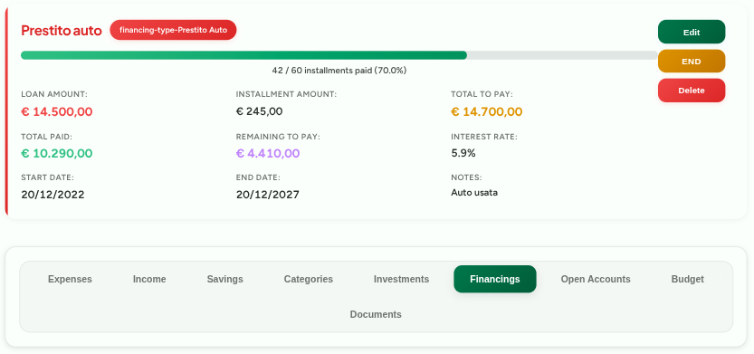

*Mortgages and loans with instalment progress, total paid, remaining balance and interest rate.*

### Documents

Google Drive integration to keep your paperwork organized:

- 32 predefined folders for payslips, invoices, deductible expenses, medical reports, investment documents, loan documents, contracts, insurance, tax documents, warranties, bank statements, credit cards, bills, taxes, real estate, vehicles, pension, donations, education, cryptocurrencies, condo fees, legal expenses, veterinary expenses, average balances and miscellaneous
- Folders organized per year automatically (2024, 2025, ...)
- Choose which folders you want to see
- Quick links that open the folders straight in Google Drive
- OAuth 2.0 authentication, no password sharing
- Folder names translated based on your language
- Folder preferences saved in the cloud and synced

### Backup on your own Drive

Once Drive is connected, Budgee writes a copy of your data into a **Budgee Backup** folder every seven days. It keeps the last eight copies and deletes the older ones by itself.

There is no server behind it, so the backup starts when you open the app rather than at a fixed hour: if you do not open Budgee for two weeks, the copy waits for you. The app says so in plain words instead of letting you assume otherwise, and it tells you when the last one actually ran.

Budgee only sees the files it created on your Drive. It cannot read the rest.

### Documents for your accountant

At tax time the hard part is not the arithmetic, it is remembering what to hand over. The **Documents for your accountant** wizard in your profile asks which return you are filing, which year, and which situations apply to you (property, family, medical expenses, and so on). It then walks you through the sections that are actually relevant, and for each one it points at the Drive folder where that paperwork normally lives.

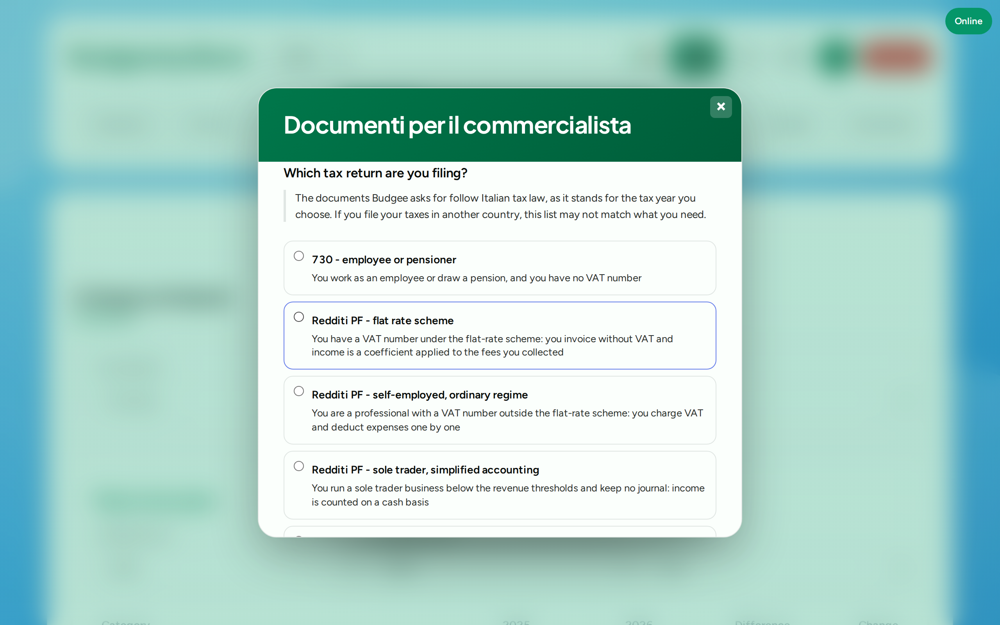

*Seven profiles, from an employee filing a 730 to a business on ordinary accounting. Only the chapters you tick become screens.*

What comes out is a single ZIP holding the documents you picked, plus what Budgee already knows:

- Your deductible expenses for the year, grouped by category, with the totals
- A list of what is missing, keeping the mandatory items apart from the optional ones, so your accountant knows what to ask for
- A note about the deductible expenses you paid in cash, which since 2020 generally lose the 19% relief unless they are medicines or a public health provider
- A list of the things nobody can put in a folder, such as your IBAN or your dependants' tax codes. Budgee names them without including them: a ZIP travelling by email is no place for those.

The wizard reads the Italian rules for the tax year you pick. If you file elsewhere, the list will not match what you need.

A notice stays at the top of the wizard for its whole length: the amounts are estimates worked out from the data you entered, and an accountant should check them. Budgee organises documents, it does not give tax advice, and that is better read while using the tool than inside a document nobody opens.

### Recurring transactions

Automation for repeating expenses and income:

- Frequencies: daily, weekly (with day of week), monthly (first day, last day or a specific day), yearly
- Each occurrence has to be confirmed before it lands in your records, so nothing is added behind your back
- Edit the amount, description and payment method; delete a single occurrence or all future ones; check the confirmation history
- Cloud sync via Firestore
- Typical uses: rent, salary, subscriptions, utilities, insurance, loan instalments

### Insights and reports

The data view:

- Calendar heatmap with spending intensity for every day of the month
- Sankey diagram of where your money flows across categories
- Cumulative trend charts for expenses, income and savings over time
- Pattern detection on spending behaviour and anomalies
- Comparison between the current period and previous ones
- Tailored suggestions based on your habits
- Search with filters on category, period, amount, keywords
- Custom reports for any time range, with proportional budget calculations

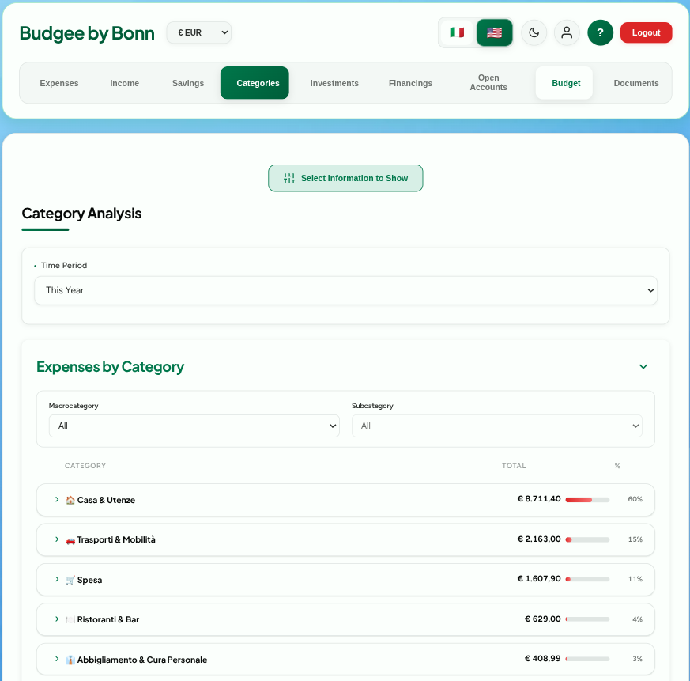

*Category analysis ranks spending by macro-category, with drill-down to sub-categories and percentage share.*

The Categories tab also compares two whole years, one category at a time. A category that shows up in one year only stays in the table with the other year at zero, because a line that disappears is usually the one worth looking at.

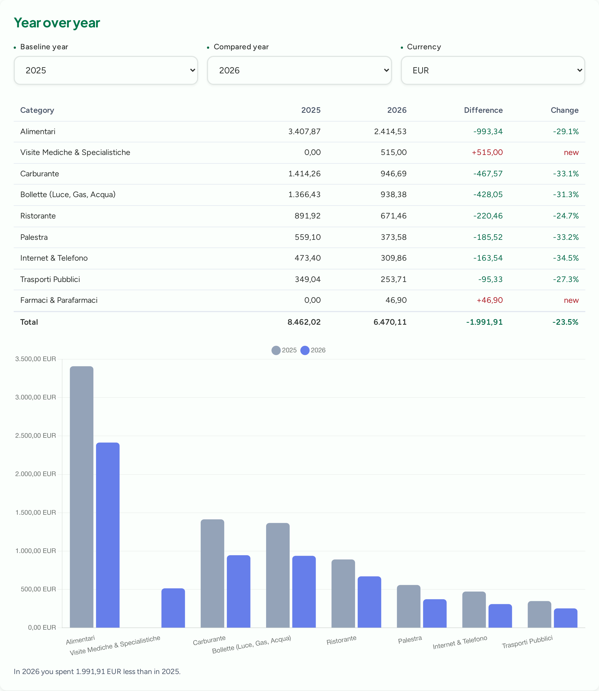

*Difference and percentage change per category, with the two years side by side. One currency at a time: adding up different currencies would produce a number that means nothing.*

### Open accounts

Track money you owe and money owed to you:

- Account types: debt or credit
- Per-account details: name of the person or supplier, type, initial amount, current balance, opening date, notes
- Payment history with date and amount for each instalment
- Accounts automatically marked closed when the balance hits zero
- Consolidated view in one list, or separated by active/closed
- Linked transactions: every payment associated with the account
- Totals: credits, debts, net balance
- Search by name, type, amount range or date
- CSV export

### Savings goals

Set and follow concrete targets:

- Goal types: one-off with a deadline, or ongoing
- Per-goal details: target amount, saved so far, deadline, progress percentage
- Colour-coded progress bars and completion markers
- Track how much of your liquid balance is allocated to goals
- Create, edit, archive or delete a goal at any time
- Automatic monthly amount needed to hit the deadline
- Priority by importance and deadline
- Visual confirmation when a goal is completed
- Archive view for past goals

### Tax-deductible expenses

A dedicated section for tax season:

- Flag expenses as deductible as you record them
- View deductibles grouped by tax year
- Quick access to current and previous year
- Drill down to any past year
- Add deductibles that do not have a matching expense (extras)
- Breakdown by category, to see what contributes most
- Yearly total
- Export-ready for tax preparation
- Recurring deductibles auto-flagged
- Track deductible investment contributions too

### Languages

Italian and English, from a single selector at the top next to the currency. Interface, categories, charts, statistics and document folder names follow your language.

Legal pages follow a separate rule: the privacy notice and the terms of use appear only in the languages where a person has read the text. An interface can fall back quietly to another language, a binding document cannot.

### Light and dark theme

Choose light or dark mode from the header. The setting is saved and synced.

<table>
<tr>
<td></td>
<td>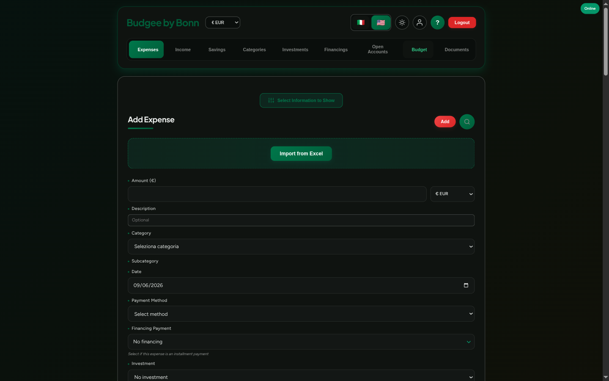</td>
</tr>
<tr>
<td align="center"><em>Light mode</em></td>
<td align="center"><em>Dark mode</em></td>
</tr>
</table>

### Built for mobile

Budgee is designed mobile-first: every section adapts to small screens with bottom-tab navigation and compact layouts. Install it from your browser to launch it like a native app.

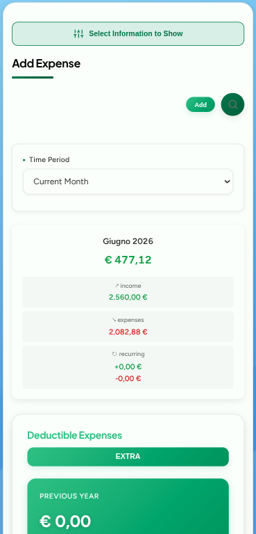
&nbsp;&nbsp;&nbsp;
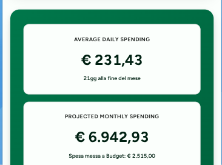

### Interactive tutorial

First-time users go through a guided tour that explains the main features.

### When a new version ships

On open, Budgee checks whether one has been published and tells you if so: update now, or later. Until you accept you keep using the version you opened, so the app does not change under your hands while you are entering an expense. If you postpone you find the notice again next time, and with several tabs open, accepting in one updates the others.

---

## Privacy and security

Your financial data is sensitive, and Budgee treats it that way:

- Each user can only access their own data, enforced at the database level
- All connections use HTTPS; data is stored with AES-256 encryption
- Accounts must verify their email before use
- Passwords must be at least 8 characters, with uppercase, lowercase and numbers
- No tracking, no ads; Budgee does not sell or share your data
- Data cached locally for offline use is synced back over an encrypted channel

Your profile is also where you decide what happens to your data:

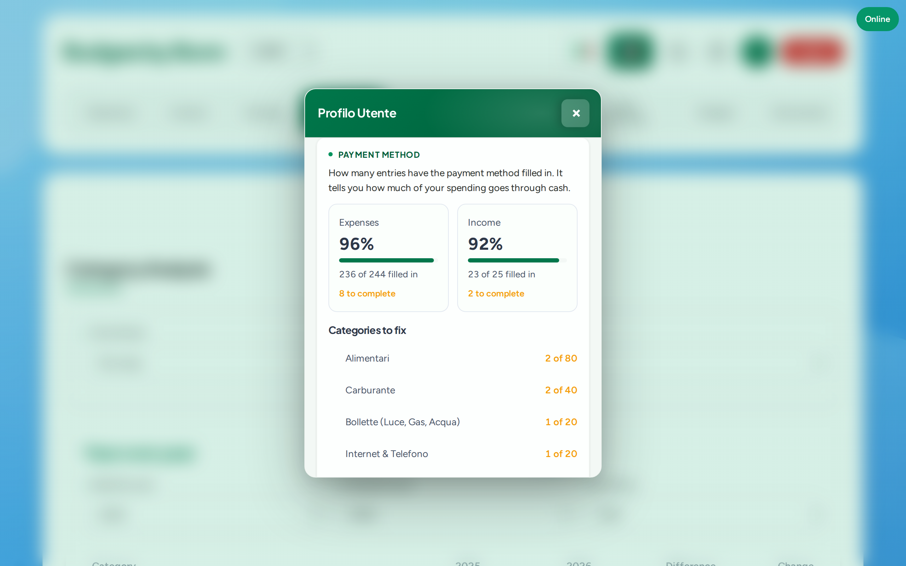

*Payment method coverage, the AI keys, the privacy notice, the export and the account deletion all live in the same screen.*

- **Take everything with you.** One button downloads the whole account as a ZIP: a full JSON plus a CSV per section. It is read from the database rather than from what the app has in memory, so nothing is left behind. The Gemini API key is the one thing left out, on purpose.
- **Delete the account for good.** Deletion walks through every part of the account, not just the main record, and confirms with your password. If it is interrupted halfway, the next login picks it up where it stopped rather than leaving orphaned data behind.
- **Read what is actually collected.** The [privacy notice](https://financial-management-by-bonn.web.app/src/pages/privacy.html) is written in Italian and English and reachable from the app itself, including from the sign-in screen: collection starts when you register, so the document belongs there and not behind the login.
- **Know what you are agreeing to.** Registration asks you to accept the [terms of use](https://financial-management-by-bonn.web.app/src/pages/terms.html), with the box never pre-ticked and both documents linked next to the point where you accept. The acceptance is recorded with the version of the text and with a moment your browser does not choose, and nobody can rewrite it afterwards.
- **Say no to the AI.** Receipt scanning is off until you turn it on, asks for a consent of its own, and can be switched off again from the same screen.

For the detailed inventory of security measures, see the [security documentation](./SECURITY.md).

---

## Under the hood

Budgee is a Progressive Web App (PWA) built with web standards:

| Component | Technology |
|-----------|-----------|
| Frontend | Vanilla JavaScript (ES6+ modules), HTML5, CSS3 with custom properties |
| Architecture | Modular, feature-based; event delegation; explicit lifecycle |
| Charts | Chart.js |
| Backend | Firebase (Firestore, Authentication, Hosting). No server-side code of its own: the logic runs in the browser and the Firestore rules are the only trust boundary |
| Documents | Google Drive API with OAuth 2.0 |
| Receipt scanning | Google Gemini, with an API key supplied by the user |
| Offline | Service Worker with Network-First caching, plus the Firestore SDK's own local cache |
| Storage | Transactions split into monthly documents, so the account keeps growing past the size limit of a single record |
| Import/Export | SheetJS (xlsx) for Excel, fflate for ZIP archives |
| Security | Content Security Policy, HTTPS enforcement, input sanitization, Firestore rules |

---

## Feature checklist

- Expense and income tracking with categories, subcategories and payment methods
- AI receipt scanning, opt-in, with the option to share a photo straight from the phone
- Cash share by month and by category, plus assisted completion of missing payment methods
- Meal vouchers with a balance of their own, kept out of liquidity and valid on income as well as expenses
- Year-on-year comparison, one category at a time
- Budget management with real-time monitoring and alerts
- Savings analysis with automatic calculations and trend chart
- Investment portfolio with returns and maturity dates
- Loan management with payment tracking and progress visualization
- Open accounts for credits and debts
- Savings goals with progress and deadline
- Tax-deductible expenses organized per year
- Document management with Google Drive integration
- Weekly backup on your own Drive, with the last eight copies kept
- Guided package of documents for your accountant, across seven tax profiles
- Full account export as a ZIP, and account deletion that leaves nothing behind
- Terms of use and privacy notice reachable from the sign-in screen, with the acceptance recorded and not rewritable
- A notice when a new version ships, with the update applied only if you accept it
- Recurring transactions with flexible scheduling
- Search across all data types
- Spending insights with pattern detection
- Multi-currency: EUR, USD, GBP, PLN, with the entry currency remembered per form
- Multi-language: Italian, English
- Light and dark theme
- Offline mode with automatic sync
- Installable as a PWA on any device
- Excel import and export
- Cloud sync
- Interactive tutorial

---

## License

This project is proprietary. The web app is free for personal use. See [LICENSE](./LICENSE) for details.

---

## Feedback and support

If you have feedback, suggestions or a bug to report, get in touch.

Read the [feedback guide](./FEEDBACK.md) for how to:

- Report bugs in a way that is actually useful
- Request new features
- Share your experience
- Ask for support

Quick contact: andreabonacci95@protonmail.com

---

## Author

Built by Andrea Bonacci - [github.com/AndreaBonn](https://github.com/AndreaBonn)

---

## Support the project

Budgee is free to use. If it helps you keep your finances under control and you want to give something back, you can leave a tip via PayPal. The amount is up to you and it is entirely optional.

---

*The source code is private, but the app is free to use.*

*If Budgee turned out to be useful for you, a star on the repository is appreciated.*

**© 2025-2026 Andrea Bonacci**

