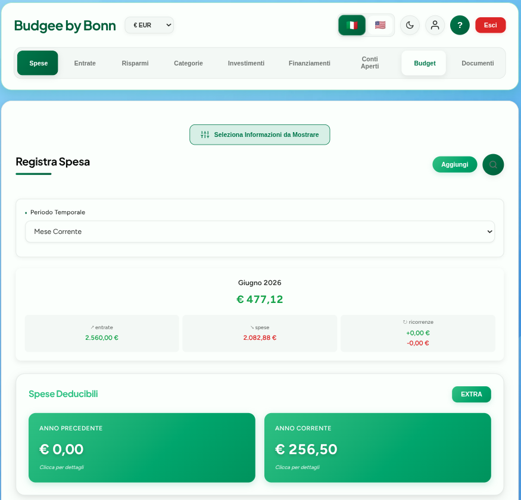
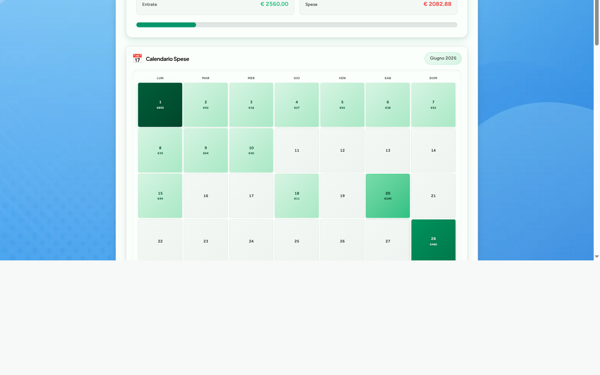
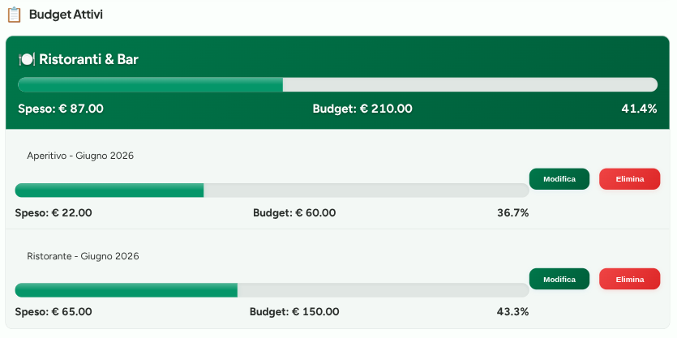
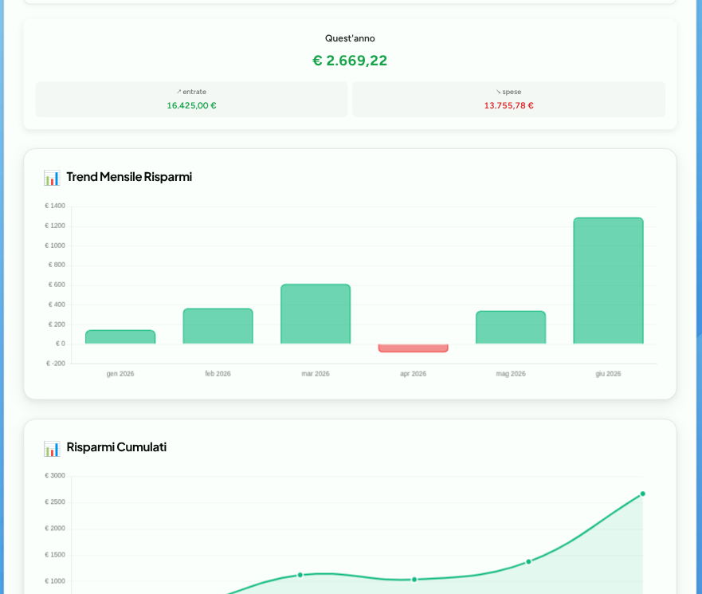
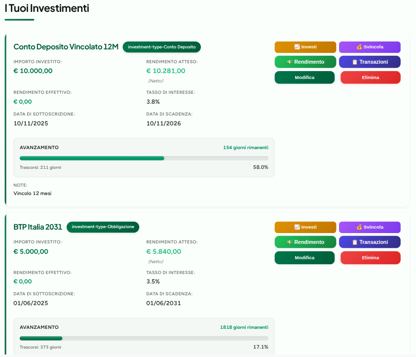
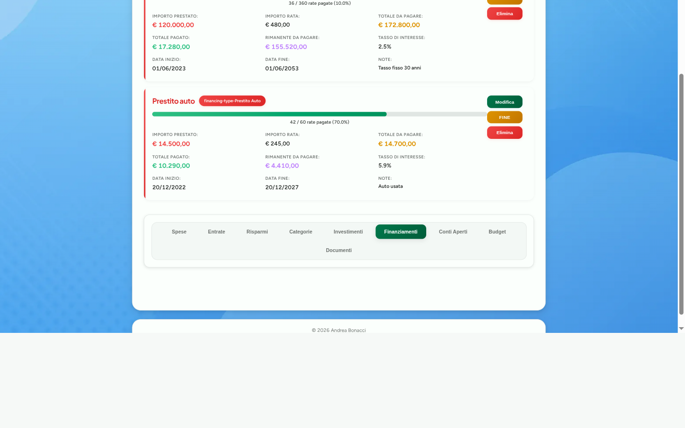
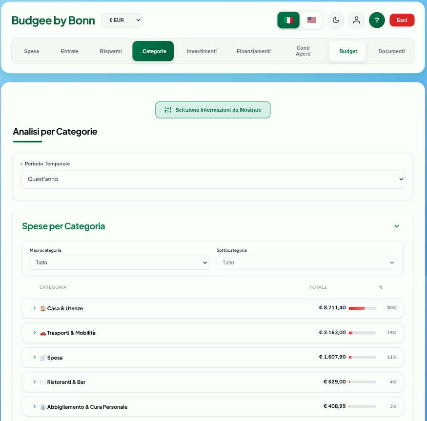
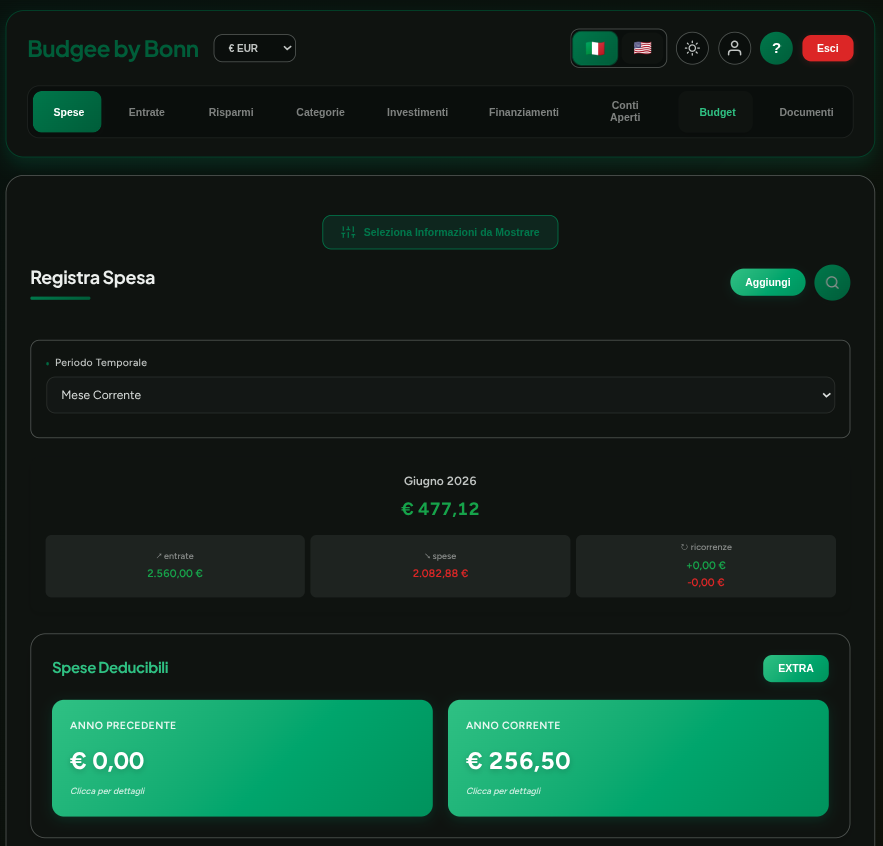
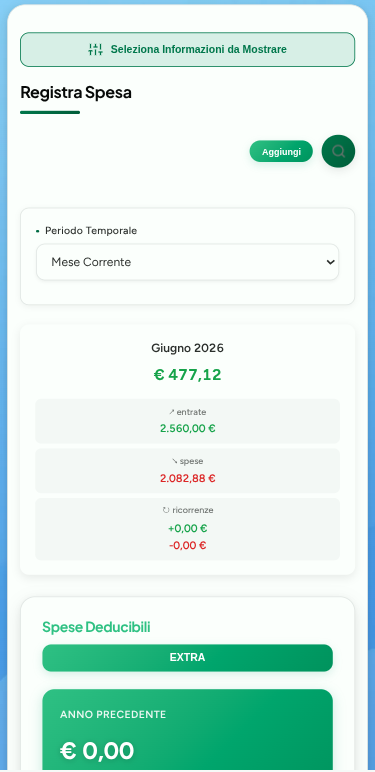
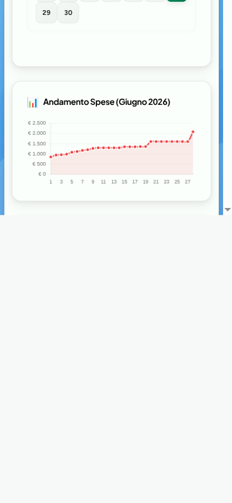

# Budgee - Gestione Finanze Personali

**Tieni sotto controllo le tue finanze, senza stress**

[Apri l'app](https://financial-management-by-bonn.web.app) · Installabile come PWA · Sincronizzata sul cloud · Gratuita

---

## Cos'è Budgee

Budgee è una Progressive Web App (PWA) per le finanze personali. Tracci spese ed entrate, imposti budget mensili, segui investimenti e finanziamenti, conservi documenti finanziari su Google Drive e gestisci obiettivi di risparmio - da qualsiasi dispositivo, con sincronizzazione cloud in tempo reale.

È pensata per chi tiene i conti in un quaderno o in un foglio Excel disordinato e vuole qualcosa di più semplice senza rinunciare al dettaglio.

*Riepilogo del mese: entrate, spese, tasso di risparmio e totali deducibili in un'unica pagina.*

---

## Guardalo in azione

Un giro completo: accesso, dashboard delle spese, aggiunta di una spesa, entrate, risparmi, aggiunta e svincolo di un investimento, budget.

*L'anteprima qui sopra è accelerata. Clicca sulla GIF per aprire il video completo ([budgee-demo.mp4](./docs/media/budgee-demo.mp4)).*

---

## Cosa ti offre

- Tutto in una sola app: spese, entrate, budget mensili, investimenti, finanziamenti, conti aperti, obiettivi di risparmio, spese deducibili e documenti
- Nessun abbonamento, nessuna versione premium, nessuna pubblicità
- Funziona su smartphone, tablet e desktop; la installi dal browser e si comporta come un'app nativa
- Sincronizzazione cloud via Firebase, gli stessi dati ti seguono fra dispositivi
- Funziona offline; ciò che inserisci senza connessione si sincronizza al rientro
- Pronta in pochi minuti: ti registri e sei dentro
- Rilevamento di pattern sulle tue spese con suggerimenti pratici
- Multi-valuta: EUR, USD, GBP e PLN con conversione automatica

---

## Come iniziare

### 1. Apri l'app

Vai su [financial-management-by-bonn.web.app](https://financial-management-by-bonn.web.app) da qualsiasi browser (Chrome, Safari, Firefox, Edge).

### 2. Crea il tuo account

Tocca **Registrati** e inserisci email e password. Riceverai un'email di verifica; clicca sul link per attivare l'account.

### 3. Installa sul dispositivo (opzionale)

Su mobile, il browser ti proporrà "Aggiungi alla schermata Home". Accetta e Budgee comparirà come un'app nativa. Su desktop, cerca l'icona di installazione nella barra degli indirizzi.

### 4. Aggiungi le prime transazioni

Inizia aggiungendo qualche spesa o entrata del mese corrente. Ogni transazione richiede importo, categoria e data.

### 5. Imposta i budget

Apri la sezione **Budget** e imposta i limiti di spesa per le categorie che vuoi monitorare. Budgee terrà traccia dei progressi in tempo reale.

---

## Come usare Budgee

### Spese ed entrate

Il cuore dell'app. Per ogni transazione puoi impostare:

- Importo e valuta (EUR, USD, GBP, PLN)
- Categoria, scelta da categorie gerarchiche che puoi personalizzare
- Sottocategoria per maggiore dettaglio
- Descrizione libera
- Data e metodo di pagamento (contanti, digitale, bonifico, crypto, addebito automatico, assegni)
- Collegamento a una rata di finanziamento o a un versamento su un investimento
- Flag deducibile per la dichiarazione di fine anno
- Frequenza ricorrente (giornaliera, settimanale, mensile, annuale)

Cose che puoi fare in più:

- Importare transazioni da un file `.xlsx` in blocco
- Esportare i dati in CSV per backup o uso esterno
- Cercare fra le transazioni per data, categoria, importo, parola chiave, metodo di pagamento o elemento collegato
- Leggere statistiche in tempo reale: media giornaliera, proiezione di fine mese, giorno con spesa più alta
- Aprire grafici di trend mensile, settimanale, annuale e distribuzione per categoria

*Il calendario giornaliero usa l'intensità del colore per evidenziare i giorni con spesa più alta; il grafico del trend mostra come la spesa si accumula giorno per giorno.*

### Budget

Imposti un limite di spesa mensile per ogni categoria. Budgee ti mostra:

- Quanto hai speso rispetto al limite, con barre di progresso
- Una proiezione di dove stai andando a fine mese
- Un click per copiare il budget del mese precedente, così non devi reinserire i limiti ogni volta

Le categorie di budget lavorano in gerarchia: prima la macro-categoria, poi le sotto-categorie. Decidi tu quanto scendere nel dettaglio.

*Budget gerarchici per macro e sotto-categoria, con barre di progresso e avvisi di sforamento.*

### Risparmi

Una sezione dedicata che calcola i risparmi dalla differenza fra entrate e spese:

- Grafico mensile dei risparmi nel tempo
- Linea dei risparmi cumulati
- Saving rate (la quota di reddito che effettivamente tieni)
- Mesi migliori e peggiori a colpo d'occhio
- Rilevamento di pattern con suggerimenti brevi

*Trend dei risparmi mese per mese con totali dell'anno corrente e saving rate.*

### Investimenti

Il portafoglio in un unico posto:

- Tipi di asset: obbligazioni, conti deposito, azioni, fondi comuni, ETF, criptovalute, immobili e altro
- Dettagli per investimento: importo investito, data sottoscrizione, tasso di interesse, data scadenza, rendimento atteso lordo/netto, rendimento effettivo, note libere
- Barre di progresso temporali su quanto manca alla scadenza
- Collegamento di dividendi, interessi o affitti all'investimento giusto
- Collegamento di spese per tracciare versamenti di capitale aggiuntivi
- Totali di portafoglio: capitale investito, rendimenti attesi, rendimenti effettivi, tasso medio, prossima scadenza
- Ricerca con filtri multipli

*Ogni card mostra importo investito, rendimento atteso, tasso di interesse, progresso fino alla scadenza e azioni rapide per i movimenti di capitale.*

### Finanziamenti

Tieni traccia di ogni forma di debito:

- Tipologie: mutui casa, prestiti auto, prestiti personali, prestiti studenti, finanziamento telefono, riscatto laurea e altro
- Dettagli per finanziamento: importo, date di inizio e fine, rate totali, importo rata, tasso di interesse, rate pagate, totale pagato, saldo residuo, note
- Barre di progresso su quanto manca a chiudere il prestito
- Collegamento di spese alle rate per registrare i pagamenti reali
- Inserimento di rate pagate o importo cumulato
- Totali del portafoglio: totale prestato, totale da pagare (con interessi), già pagato, residuo, rata media mensile, progresso medio
- Ricerca e vista di dettaglio con storico pagamenti e piano di ammortamento

*Mutui e prestiti con progresso delle rate, totale pagato, saldo residuo e tasso di interesse.*

### Documenti

Integrazione con Google Drive per tenere ordinati i documenti finanziari:

- 27+ cartelle predefinite per buste paga, fatture incassate e pagate, spese detraibili, referti medici, documenti investimenti, documenti finanziamenti, contratti, assicurazioni, documenti fiscali, garanzie, estratti conto, carte di credito, bollette, tasse, immobili, veicoli, pensione, donazioni, spese scolastiche, criptovalute, spese condominiali, spese legali, spese veterinarie, giacenze medie e varie
- Cartelle organizzate per anno in automatico (2024, 2025, ...)
- Scegli quali cartelle visualizzare
- Link diretti che aprono le cartelle su Google Drive
- Autenticazione OAuth 2.0, senza condividere password
- Nomi delle cartelle tradotti in base alla lingua scelta
- Preferenze sulle cartelle salvate sul cloud e sincronizzate

### Transazioni ricorrenti

Automazione per spese ed entrate che si ripetono:

- Frequenze: giornaliera, settimanale (con giorno della settimana), mensile (primo giorno, ultimo giorno o giorno specifico), annuale
- Ogni occorrenza richiede conferma prima di finire nei record, così nulla viene aggiunto a tua insaputa
- Modifica importo, descrizione e metodo di pagamento; elimina una singola occorrenza o tutte le future; consulta lo storico delle conferme
- Sincronizzazione cloud via Firestore
- Usi tipici: affitto, stipendio, abbonamenti, bollette, assicurazioni, rate di finanziamento

### Analisi e report

La vista dei dati:

- Heatmap calendario con intensità di spesa per ogni giorno del mese
- Diagramma Sankey su dove vanno i tuoi soldi tra le categorie
- Grafici di trend cumulati per spese, entrate e risparmi nel tempo
- Rilevamento di pattern e anomalie nel comportamento di spesa
- Confronto fra il periodo corrente e quelli precedenti
- Suggerimenti calibrati sulle tue abitudini
- Ricerca con filtri su categoria, periodo, importo, parole chiave
- Report personalizzati per qualsiasi intervallo, con calcoli budget proporzionali

*L'analisi categorie ordina la spesa per macro-categoria, con drill-down nelle sotto-categorie e percentuale sul totale.*

### Conti aperti

Traccia soldi che devi e soldi che ti devono:

- Tipi di conto: debito o credito
- Dettagli per conto: nome della persona o del fornitore, tipo, importo iniziale, saldo corrente, data di apertura, note
- Storico pagamenti con data e importo per ogni rata
- Conti automaticamente marcati chiusi quando il saldo arriva a zero
- Vista consolidata in un'unica lista o separata fra attivi e chiusi
- Transazioni collegate: ogni pagamento associato al conto
- Totali: crediti, debiti, saldo netto
- Ricerca per nome, tipo, importo o data
- Esportazione in CSV

### Obiettivi di risparmio

Imposta e segui obiettivi concreti:

- Tipi di obiettivo: una tantum con scadenza, oppure ricorrenti
- Dettagli per obiettivo: importo target, risparmiato finora, scadenza, percentuale di progresso
- Barre di progresso colorate e indicatori di completamento
- Quota del saldo liquido allocata agli obiettivi
- Crea, modifica, archivia o elimina un obiettivo in qualsiasi momento
- Calcolo automatico della quota mensile per raggiungere la scadenza
- Priorità per importanza e scadenza
- Conferma visiva al completamento
- Vista di archivio per gli obiettivi passati

### Spese deducibili

Una sezione dedicata alla stagione delle dichiarazioni:

- Marca le spese come deducibili mentre le registri
- Visualizza le deducibili raggruppate per anno fiscale
- Accesso rapido all'anno corrente e a quello precedente
- Drill-down su qualsiasi anno passato
- Aggiungi deducibili senza una spesa corrispondente (extra)
- Suddivisione per categoria, per vedere chi pesa di più
- Totale annuale
- Pronta per l'esportazione utile in dichiarazione
- Deducibili ricorrenti marcate in automatico
- Tracci anche versamenti di capitale deducibili

### Lingue

Italiano e inglese. Cambi lingua dalle impostazioni quando vuoi. Interfaccia, categorie, grafici, statistiche e nomi delle cartelle documenti seguono la lingua scelta.

### Tema chiaro e scuro

Scegli chiaro o scuro dall'header. La preferenza viene salvata e sincronizzata.

<table>
<tr>
<td></td>
<td></td>
</tr>
<tr>
<td align="center"><em>Tema chiaro</em></td>
<td align="center"><em>Tema scuro</em></td>
</tr>
</table>

### Pensata per il mobile

Budgee è progettata mobile-first: ogni sezione si adatta agli schermi piccoli con navigazione a bottom-tab e layout compatti. Installala dal browser per lanciarla come un'app nativa.

&nbsp;&nbsp;&nbsp;

### Tutorial interattivo

Alla prima apertura un tour guidato spiega le funzioni principali.

---

## Privacy e sicurezza

I tuoi dati finanziari sono sensibili e Budgee li tratta come tali:

- Ogni utente accede solo ai propri dati, garantito a livello di database
- Tutte le connessioni passano da HTTPS; i dati sono cifrati a riposo con AES-256
- Gli account devono verificare l'email prima dell'uso
- La password deve essere lunga almeno 8 caratteri, con maiuscole, minuscole e numeri
- Nessun tracciamento, nessuna pubblicità; Budgee non vende e non condivide i tuoi dati
- I dati in cache offline si sincronizzano al rientro su un canale cifrato

Per l'inventario dettagliato delle misure di sicurezza, vai alla [documentazione sulla sicurezza](./SECURITY_IT.md).

---

## Sotto il cofano

Budgee è una Progressive Web App (PWA) basata su standard web:

| Componente | Tecnologia |
|-----------|-----------|
| Frontend | Vanilla JavaScript (moduli ES6+), HTML5, CSS3 con custom properties |
| Architettura | Modulare, organizzata per feature; event delegation; lifecycle esplicito |
| Grafici | Chart.js |
| Backend | Firebase (Firestore, Authentication, Cloud Functions, Hosting) |
| Documenti | Google Drive API con OAuth 2.0 |
| Notifiche | Telegram Bot API |
| Offline | Service Worker con caching Network-First |
| Import/Export | SheetJS (xlsx) per Excel, JSZip per gli export compressi |
| Sicurezza | Content Security Policy, HTTPS forzato, sanitizzazione input, Firestore rules |

---

## Checklist delle funzionalità

- Tracciamento spese ed entrate con categorie, sottocategorie e metodi di pagamento
- Gestione budget con monitoraggio in tempo reale e avvisi
- Analisi dei risparmi con calcoli automatici e grafico di trend
- Portafoglio investimenti con rendimenti e date di scadenza
- Gestione finanziamenti con tracciamento pagamenti e visualizzazione del progresso
- Conti aperti per crediti e debiti
- Obiettivi di risparmio con progresso e scadenza
- Spese deducibili organizzate per anno
- Gestione documenti con integrazione Google Drive
- Transazioni ricorrenti con programmazione flessibile
- Ricerca su tutti i tipi di dato
- Insight sulle spese con rilevamento pattern
- Multi-valuta: EUR, USD, GBP, PLN
- Multi-lingua: italiano, inglese
- Tema chiaro e scuro
- Modalità offline con sincronizzazione automatica
- Installabile come PWA su qualsiasi dispositivo
- Import ed export Excel
- Sincronizzazione cloud
- Tutorial interattivo

---

## Licenza

Questo progetto è proprietario. L'app web è gratuita per uso personale. Per i dettagli vedi [LICENSE](./LICENSE).

---

## Feedback e supporto

Se hai feedback, suggerimenti o un bug da segnalare, scrivimi.

Leggi la [guida feedback](./FEEDBACK_IT.md) per sapere come:

- Segnalare bug in modo davvero utile
- Richiedere nuove funzionalità
- Condividere la tua esperienza
- Chiedere supporto

Contatto rapido: andreabonacci95@protonmail.com

---

## Autore

Creata da Andrea Bonacci - [github.com/AndreaBonn](https://github.com/AndreaBonn)

---

## Sostieni il progetto

Budgee è gratuita. Se ti aiuta a tenere sotto controllo le tue finanze e vuoi contribuire, puoi lasciare un'offerta tramite PayPal. L'importo lo scegli tu ed è del tutto facoltativo.

---

*Il codice sorgente è privato, ma l'uso dell'app è completamente libero e gratuito.*

*Se Budgee ti è stata utile, lascia una stella al repository.*

**© 2025-2026 Andrea Bonacci**

