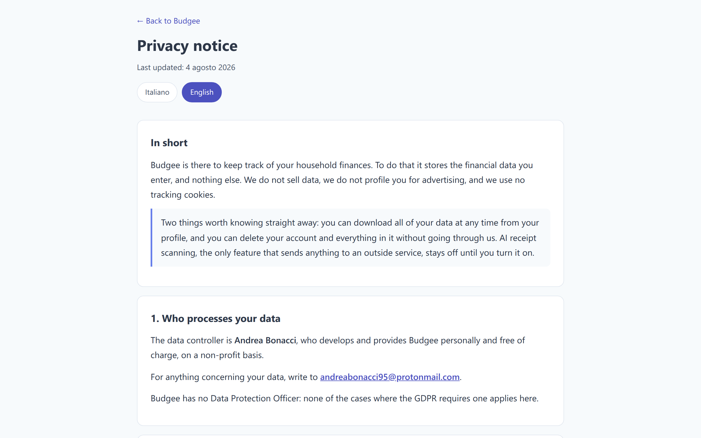

# Budgee - User Guide

<div align="center">

**Everything Budgee does, in the order you are likely to need it**

[Back to the README](./README.md) · [Open the app](https://financial-management-by-bonn.web.app)

[](./USER_GUIDE_IT.md)

</div>

---

## Table of contents

1. [Before you start](#1-before-you-start)
2. [Your account](#2-your-account)
3. [Finding your way around](#3-finding-your-way-around)
4. [Recording an expense](#4-recording-an-expense)
5. [Recording income](#5-recording-income)
6. [Scanning a receipt with AI](#6-scanning-a-receipt-with-ai)
7. [Payment methods](#7-payment-methods)
8. [Recurring transactions](#8-recurring-transactions)
9. [Budgets](#9-budgets)
10. [Savings, liquidity and goals](#10-savings-liquidity-and-goals)
11. [Investments](#11-investments)
12. [Loans and financing](#12-loans-and-financing)
13. [Open accounts](#13-open-accounts)
14. [Deductible expenses](#14-deductible-expenses)
15. [Reading your numbers](#15-reading-your-numbers)
16. [Documents on Google Drive](#16-documents-on-google-drive)
17. [The weekly backup](#17-the-weekly-backup)
18. [Documents for your accountant](#18-documents-for-your-accountant)
19. [Importing and exporting](#19-importing-and-exporting)
20. [Your data and your privacy](#20-your-data-and-your-privacy)
21. [Working offline](#21-working-offline)
22. [When something does not add up](#22-when-something-does-not-add-up)

---

## 1. Before you start

Budgee runs in the browser. There is nothing to download from a store and nothing to install by hand.

**What you need**

- A recent browser: Chrome, Safari, Firefox or Edge
- An email address you can read, for the verification message
- A connection, at least the first time. After that Budgee also works offline.

**Installing it like an app (optional, recommended on a phone)**

1. Open [financial-management-by-bonn.web.app](https://financial-management-by-bonn.web.app).
2. On a phone, accept the browser's "Add to Home Screen" prompt. On a desktop, click the install icon in the address bar.
3. Budgee gets its own icon and opens without the browser bars.

Installing also unlocks one thing the browser tab cannot do: sharing a photo to Budgee from the gallery. See [chapter 6](#6-scanning-a-receipt-with-ai).

---

## 2. Your account

### Registering

1. Open the app and choose **Register**.
2. Enter your email and a password of at least 8 characters, with an uppercase letter, a lowercase letter and a digit.
3. You will receive a verification email. Click the link inside it.
4. Come back to Budgee and sign in.

The verification step is not optional: an unverified account cannot use the app. If the message does not arrive within a few minutes, check the spam folder before asking for another one.

### Signing in and out

The header holds your profile, the theme switch, the language switch, the currency selector and the exit button. Budgee signs you out on its own after a long stretch of inactivity, which is deliberate: this is financial data on a device that might not be only yours.

### Changing your password

Open **Profile** from the header. The same screen holds the password change, the data export and the account deletion.

---

## 3. Finding your way around

Budgee is divided into nine sections, reachable from the tabs at the top on a desktop and from the bar at the bottom on a phone:

| Section | What lives there |
|---|---|
| **Expenses** | Everything you spend, the calendar, the trends, the cash share |
| **Income** | Everything you earn |
| **Savings** | What is left over, your available liquidity and your goals |
| **Categories** | Category analysis, comparisons, the year-on-year view |
| **Investments** | Your portfolio and its movements |
| **Financing** | Mortgages, loans and instalments |
| **Open accounts** | Money you owe and money owed to you |
| **Budget** | Monthly limits per category |
| **Documents** | Your paperwork on Google Drive |

### The controls in the header

- **Theme**: light or dark. The choice is saved and follows you across devices.
- **Language**: Italian or English. The interface, the categories, the charts and the document folder names all switch.
- **Currency**: the currency amounts are shown in. Budgee handles EUR, USD, GBP and PLN and converts between them.
- **Profile**: settings, AI keys, payment method coverage, privacy, export, deletion.
- **Help**: reopens the guided tour that you saw the first time.
- **Sync indicator**: tells you whether Budgee is online and whether everything has been saved.

### Filtering by period

Most sections have a period filter: current month, previous month, year, or a custom range. The statistics, the charts and the lists follow the period you pick.

### Hiding what you do not use

Each section has a **Choose which parts to show** button. Not everyone wants the calendar, or the Sankey diagram, or the cash chart. Turn off what you do not read: the choice is saved and synced, so you set it once.

---

## 4. Recording an expense

1. Open the **Expenses** tab.
2. Press **Add**. The form opens.
3. Fill in what applies:

| Field | Notes |
|---|---|
| **Amount** and currency | Required. Choose the currency next to the number. |
| **Description** | Free text, such as "weekly shop". |
| **Category** | Required. Pick the macro-category first. |
| **Subcategory** | Optional but recommended: it is what makes the analyses readable. |
| **Date** | Defaults to today. |
| **Payment method** | Required when you fill the form by hand. See [chapter 7](#7-payment-methods). |
| **Linked loan instalment** | Ties the expense to a loan, so the balance goes down by itself. |
| **Linked investment** | Ties the expense to a capital contribution. |
| **Recurring** | Turns the expense into a recurring one. See [chapter 8](#8-recurring-transactions). |
| **Tax-deductible** | Flags the expense for the end-of-year report. See [chapter 14](#14-deductible-expenses). |

4. Press **Add Expense**.

The expense appears in the list, and the totals, the calendar and the charts update immediately.

### Editing or deleting

Open any expense from the list, or from a detail popup in the analyses. Every detail view has **Edit** and **Delete** inside it, so you do not have to go hunting for the original entry.

### Searching

The magnifying glass in the section header searches by keyword, date, category, amount range, payment method or linked item.


*The daily calendar marks heavier days with a stronger colour. The trend below shows how the month builds up.*

---

## 5. Recording income

The same form, with two differences: there is no deductible flag, and the payment methods on offer are the ones that make sense for money coming in (a direct debit is not a way of being paid; a voucher is).

1. Open the **Income** tab.
2. Press **Add**.
3. Fill in amount, currency, category, description, date and payment method.
4. If the money is a return on an investment, link it there: the investment records the actual return by itself.
5. Press **Add Income**.

---

## 6. Scanning a receipt with AI

Instead of typing a receipt, you can photograph it. Budgee sends the image to Google Gemini, gets back the amount, the date, the description and a category suggestion, and fills the form in for you.


This feature is off until you switch it on, and it needs two things: an API key of your own, and your explicit consent.

### Setting it up, once

1. Open **Profile** from the header and scroll to the **AI** section.
2. Paste a Google Gemini API key. Budgee tests it on the spot and tells you whether it works.
3. You can add more than one key: if one hits its limit, the next one takes over.

The key is yours, it is stored in your account, and it is the one piece of data left out of both the export and the backup, so it never ends up in a file you might forward to someone.

### Giving consent

The first time you press the camera button, Budgee explains what is about to happen: the image leaves the app and reaches Google. A receipt can say a lot about you, from medicines to medical visits, so this is a separate decision from using Budgee itself. You accept it once and can withdraw it whenever you like, from the same profile screen. Withdrawing it turns the scan off; nothing else changes.

### Scanning

1. In **Expenses** or **Income**, press the camera button next to **Add**.
2. Upload a photo, a screenshot or a PDF. The limit is 10 MB.
3. Press **Extract data** and wait a few seconds.
4. The form opens already filled in. **Check it**, correct what is wrong, and save.

Budgee never saves the result on its own. What the AI reads is a proposal, and a receipt photographed at an angle in bad light can be misread.

### If the direction does not match

Scanning an invoice that reads as income while the expense form is open makes Budgee stop and ask which of the two you meant. It is the one mistake that would quietly corrupt your figures, so it asks rather than guesses.

### Sharing a photo from your phone

If you installed Budgee on your phone, it appears among the apps you can share to. Take the picture, hit share, choose Budgee: the app opens on the scan with the image already loaded. If the app was closed, the photo waits for it to open.

---

## 7. Payment methods

Every transaction can say how it was paid: cash, card or app, cheque, bank transfer, crypto, direct debit for expenses, voucher for income.

The field is required when a person fills in the form. Records the app generates on its own, such as a confirmed recurring entry or an investment return, keep filling it in their own way.

### It is pre-filled for you

Budgee looks at what you normally use for that category. If your groceries are always cash and your utility bills always direct debit, the field arrives already set. It only pre-selects when the field is still empty, so it never overrides a choice you made.

### If your history predates the field

Open **Profile**. The **Payment method** section shows how much of your history is covered, on expenses and on income, and which categories are the worst off.


Press the completion button and Budgee groups what is missing by category, proposing for each one the method you use most often there. You confirm the groups you agree with and it fills them in one go, rather than one entry at a time.

### Why it matters

Without this field, the cash chart in the Expenses tab has no denominator, and the tax check cannot tell which of your deductible expenses were paid in cash. Both are described further down.

---

## 8. Recurring transactions

Rent, salary, subscriptions, insurance, instalments: things that come back.

### Creating one

1. While adding an expense or an income, switch on **Recurring**.
2. Choose the frequency: daily, weekly (with the day of the week), monthly (first day, last day, or a specific day) or yearly.
3. Save.

### They ask before they land

A recurring transaction is not written into your records by itself. When one is due, Budgee asks you to confirm it. You can adjust the amount, the description and the payment method before confirming, and you can refuse a single occurrence without cancelling the whole series.

This is deliberate: an amount that appears in your accounts without you agreeing is an amount you no longer trust.

### Managing them

The **Manage recurring** button, at the top of the Expenses section, lists everything you have set up. From there you can edit a series, delete one occurrence or every future one, and go through the history of what has been confirmed.

---

## 9. Budgets

1. Open the **Budget** tab.
2. Pick a category and set a monthly limit.
3. Repeat for the categories you actually want to watch. Budgeting everything is the fastest way to stop reading any of it.

Budgee then shows, for each category, how much you have spent against the limit, a progress bar, and a projection of where the month is heading.

Budgets work on two levels: the macro-category, and the subcategories beneath it. You decide how far down to go.

**Copy last month.** The **Copy Budget from Previous Month** button brings last month's limits forward, so you do not retype them every time. You choose which ones to copy.


---

## 10. Savings, liquidity and goals

The **Savings** tab answers a different question from the Expenses tab: not where the money went, but what is left.

### The savings view

- Monthly savings and the cumulative line
- Your saving rate, the share of income you actually keep
- Best and worst months
- Short observations on the patterns Budgee finds


### Available liquidity

The liquidity card is a ladder rather than a single number:

```
total liquidity
  - what is sunk into investments
  = adjusted balance
  - what is already allocated to goals
  = really available
  + recurring income still to come this month
  - recurring expenses still to confirm
  - scheduled investments
  = available after everything already scheduled
```

The last line is the one worth reading before deciding you can afford something.

### Goals

Click the **Available liquidity** card to open your goals.

1. Press to create a goal: a name, a target amount, a deadline (or "ongoing"), a priority and a colour.
2. Budgee works out how much you would need to set aside each month to arrive on time.
3. Use the **Add savings** button on a goal to allocate money to it. Money allocated to a goal stops counting as freely spendable, which is the entire point.
4. Completed goals get a visual confirmation; past ones move to the archive.

---

## 11. Investments

### Adding one

1. Open the **Investments** tab and add an investment.
2. Choose the type: bond, deposit account, share, mutual fund, ETF, cryptocurrency, property, and so on.
3. Enter the amount invested, the subscription date, the interest rate, the maturity date if there is one, and the gross and net expected return.
4. Say where the money came from: outside your tracked accounts, entirely from your liquidity, or partly.

### The movements of an investment

Each investment carries its own history:

- **Add capital** for a top-up
- **Release capital** for a partial or total withdrawal
- **Add return** for a coupon, a dividend, an interest payment or rent collected
- **Recurring returns** for what pays out on a schedule

Every movement can be edited or deleted afterwards. Returns can be linked to an income entry, and top-ups to an expense entry, so the same money is never counted twice.

### What the portfolio tells you

Invested capital, expected returns, actual returns, average interest rate, the next maturity, and a progress bar per investment showing how much of the term has passed.


---

## 12. Loans and financing

1. Open the **Financing** tab and add a loan: mortgage, car loan, personal loan, student loan, phone instalments, and so on.
2. Enter the amount, the start and end dates, the number of instalments, the instalment amount and the interest rate.
3. Record what you have already paid, either instalment by instalment or as a cumulative figure.

From then on, an expense linked to that loan reduces the balance by itself. The detail view shows the payment history and the amortisation schedule, and the section totals tell you how much you owe in total, how much of it is interest, and what you pay per month across every loan.


---

## 13. Open accounts

For money that moves between people rather than between accounts: what you lent your brother, what the dentist has not invoiced yet, what a customer still owes you.

1. Open the **Open accounts** tab and create an account: a name, whether it is a debt or a credit, the initial amount, the opening date and notes.
2. Use **Pay** or **Collect** to record a movement. Budgee creates the matching expense or income for you.
3. Use **Add amount** when the same person adds another invoice to the same account.
4. When the balance reaches zero the account closes on its own.

The section totals separate credits from debts and show the net figure. Everything can be exported to CSV.

---

## 14. Deductible expenses

1. While recording an expense, switch on **Tax-deductible**.
2. Open the deductible box in the Expenses tab to see the running total for the current year and the one before.
3. Drill into any past year.
4. Add a deductible amount that has no matching expense with the "extra" entries.
5. Read the breakdown by category to see what actually contributes.

Recurring deductible expenses are flagged by themselves. Deductible capital contributions on investments are counted too. You can remove the flag from an expense without deleting the expense.

Everything here feeds [chapter 18](#18-documents-for-your-accountant).

---

## 15. Reading your numbers

### Category analysis

The **Categories** tab ranks your spending by macro-category, lets you drill into the subcategories, and shows what share each one takes. You can pick categories freely, compare income against expenses, and click any category to see the transactions behind the number.


### Year on year

Further down the same tab, Budgee compares two whole years, category by category, with the difference and the percentage change.


Two things to know while reading it:

- A category present in one year only stays in the table, with the other year at zero. That row is usually the interesting one.
- One currency at a time. Adding up amounts in different currencies would produce a number that means nothing.

### Cash outflows

In the Expenses tab, Budgee charts how much of your spending goes through cash, month by month and category by category.


The share is measured on amounts, not on the number of entries, and the denominator only counts what has a known payment method. Whatever is still missing is stated explicitly rather than quietly lowering the percentage.

### Insights

- A calendar heatmap of the month, day by day
- A Sankey diagram of where the money flows
- Cumulative trends for expenses, income and savings
- Patterns and anomalies, with short suggestions
- The current period against the previous ones
- Custom reports over any range, with budgets recalculated proportionally

---

## 16. Documents on Google Drive

Budgee does not store your documents. It organises them on your Drive and links to them.

1. Open the **Documents** tab.
2. Connect your Google account. Budgee asks for permission through Google's own screen: your password is never shared with it.
3. Budgee creates a **Budgee Documents** folder with 32 subfolders, from payslips to invoices, medical reports, insurance, contracts, tax documents and so on, organised by year.
4. Choose which folders you want to see. The rest stays out of your way.
5. Each folder has a direct link that opens it in Drive.

Folder names follow your language. Budgee only sees the files it created on your Drive: the rest of your Drive stays invisible to it.

---

## 17. The weekly backup

Once Drive is connected, Budgee writes a copy of your data into a **Budgee Backup** folder every seven days, and keeps the last eight copies.

One thing is worth being precise about: there is no server behind Budgee doing this at 3 a.m. The backup starts when you open the app. If you do not open it for two weeks, the copy waits for you. The app says exactly this on screen, and tells you when the last one actually ran, so nobody assumes a safety net that is not there.

---

## 18. Documents for your accountant

At tax time the hard part is not the arithmetic, it is remembering what to hand over.


1. Open **Profile** and start **Documents for your accountant**.
2. Say which return you are filing. There are seven profiles, from an employee filing a 730 to a self-employed professional, a partner in a company, or a business on simplified or ordinary accounting.
3. Pick the tax year.
4. Tick the situations that apply to you: property, family, medical expenses, education, and so on. Only the chapters you tick become screens, so an employee renting a flat with no children does not walk through twelve pages that do not concern them.
5. Go through the sections one at a time. Each one asks a question, names the Drive folder where that paperwork usually lives, and lets you pick the files straight from there.
6. Generate the archive.

**What comes out**

A single ZIP holding the documents you picked, plus what Budgee already knows:

- Your deductible expenses for the year, grouped by category, with totals, and your income
- A list of what is missing, keeping the mandatory items apart from the optional ones
- A note on the deductible expenses you paid in cash. Since 2020 the 19% relief generally requires a traceable payment, with medicines and public health providers as the exceptions. Budgee does not know who provided a service, so this is a list to check with your accountant, not a verdict.
- A list of the things that are not files at all: your IBAN, your dependants' tax codes, your withholding agent's details. Budgee names them without including them, because a ZIP travelling by email is no place for that.

The wizard follows Italian tax rules for the year you choose. If you file somewhere else, the list will not match what you need.

---

## 19. Importing and exporting

**Bringing data in.** The **Import from Excel** button in the Expenses section reads an `.xlsx` file and loads the transactions in bulk. It is the fastest way to move a spreadsheet you have been keeping for years.

**Taking data out.** Every section exports to CSV: expenses, income, investments, loans, open accounts. There is also a period export that only covers the range you are looking at.

For a full copy of everything at once, see the next chapter.

---

## 20. Your data and your privacy

Everything in this chapter lives in **Profile**.

### Export everything

One button downloads the whole account as a ZIP: a complete JSON, plus one CSV per section. It is read from the database rather than from what the app happens to have in memory, so nothing is left behind. The only thing deliberately excluded is your Gemini API key, which has no business sitting in a file you might forward.

### Delete the account

Deletion walks through every part of the account, not just the main record, and asks for your password to confirm. If it is interrupted halfway, the next sign-in picks it up where it stopped instead of leaving data behind with nobody to claim it.

This cannot be undone. Export first if there is any doubt.

### The privacy notice

The [privacy notice](https://financial-management-by-bonn.web.app/src/pages/privacy.html) is written in Italian and English and reachable from inside the app. It says what is collected, why, and who else sees it.



### AI consent

Receipt scanning asks for a consent of its own and can be withdrawn from the same screen at any time. If the notice changes in substance, Budgee asks again rather than assuming the old answer still covers the new situation.

---

## 21. Working offline

Budgee keeps working without a connection. Anything you add is stored locally and sent up as soon as you are back online; the indicator in the header tells you where things stand.

Two habits make offline use painless:

- Open the app at least once while online before a trip, so the data is fresh locally.
- Wait for the indicator to say everything is synced before closing the app on a flaky connection.

If you use Budgee on more than one device, changes made on one show up on the others without a reload.

---

## 22. When something does not add up

**I registered but I cannot get in.** The account has to be verified. Look for the email, spam folder included, and click the link.

**The verification email never arrived.** Ask for another one from the sign-in screen. If nothing comes, the address may have a typo: registering again with the correct one is the quickest route.

**My month looks empty.** Check the period filter. It is easy to leave it on a previous month or a custom range and conclude the data is gone.

**An expense will not save.** The amount, the category and, when you fill the form by hand, the payment method are required. The form says which field is holding things up.

**The AI scan says there is no key.** Add a Gemini key in Profile. Without one the feature stays off by design.

**The scan read the wrong figures.** It is a proposal, not a verdict. Correct the fields before saving; a crumpled or badly lit receipt is hard to read for anyone.

**The cash chart says a chunk is unmeasured.** Those are the transactions with no payment method. The assisted completion in Profile fixes them in bulk.

**The backup has not run.** It starts when you open the app, not on a schedule. Open Budgee with Drive connected and it catches up.

**A recurring transaction has not appeared.** It waits for your confirmation. Look at **Manage recurring**.

---

## Still stuck?

Read the [feedback guide](./FEEDBACK.md) for how to report a bug in a way that can actually be fixed, or write to andreabonacci95@protonmail.com.

<div align="center">

[Back to the README](./README.md) · [Read in Italian](./USER_GUIDE_IT.md)

**© 2025-2026 Andrea Bonacci**

</div>
