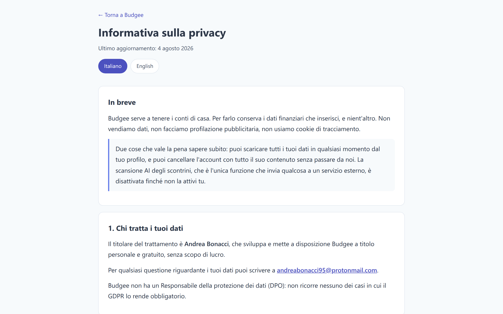

# Budgee - Manuale utente

<div align="center">

**Tutto quello che Budgee sa fare, nell'ordine in cui probabilmente ti servirà**

[Torna al README](./README_IT.md) · [Apri l'app](https://financial-management-by-bonn.web.app)

[](./USER_GUIDE.md)

</div>

---

## Indice

1. [Prima di cominciare](#1-prima-di-cominciare)
2. [Il tuo account](#2-il-tuo-account)
3. [Orientarsi nell'app](#3-orientarsi-nellapp)
4. [Registrare una spesa](#4-registrare-una-spesa)
5. [Registrare un'entrata](#5-registrare-unentrata)
6. [Scansionare uno scontrino con l'AI](#6-scansionare-uno-scontrino-con-lai)
7. [Metodi di pagamento](#7-metodi-di-pagamento)
8. [Transazioni ricorrenti](#8-transazioni-ricorrenti)
9. [Budget](#9-budget)
10. [Risparmi, liquidità e obiettivi](#10-risparmi-liquidità-e-obiettivi)
11. [Investimenti](#11-investimenti)
12. [Finanziamenti](#12-finanziamenti)
13. [Conti aperti](#13-conti-aperti)
14. [Spese deducibili](#14-spese-deducibili)
15. [Leggere i tuoi numeri](#15-leggere-i-tuoi-numeri)
16. [Documenti su Google Drive](#16-documenti-su-google-drive)
17. [Il backup settimanale](#17-il-backup-settimanale)
18. [Documenti per il commercialista](#18-documenti-per-il-commercialista)
19. [Importare ed esportare](#19-importare-ed-esportare)
20. [I tuoi dati e la tua privacy](#20-i-tuoi-dati-e-la-tua-privacy)
21. [Lavorare offline](#21-lavorare-offline)
22. [Quando i conti non tornano](#22-quando-i-conti-non-tornano)

---

## 1. Prima di cominciare

Budgee gira nel browser. Non c'è niente da scaricare da uno store e niente da installare a mano.

**Cosa serve**

- Un browser recente: Chrome, Safari, Firefox o Edge
- Un indirizzo email che puoi leggere, per il messaggio di verifica
- Una connessione, almeno la prima volta. Dopo, Budgee funziona anche offline.

**Installarla come un'app (facoltativo, consigliato sul telefono)**

1. Apri [financial-management-by-bonn.web.app](https://financial-management-by-bonn.web.app).
2. Sul telefono accetta la proposta del browser "Aggiungi alla schermata Home". Sul computer clicca l'icona di installazione nella barra degli indirizzi.
3. Budgee prende un'icona sua e si apre senza le barre del browser.

L'installazione sblocca anche una cosa che la scheda del browser non può fare: condividere una foto a Budgee dalla galleria. Vedi il [capitolo 6](#6-scansionare-uno-scontrino-con-lai).

---

## 2. Il tuo account

### Registrarsi

1. Apri l'app e scegli **Registrati**.
2. Inserisci l'email e una password di almeno 8 caratteri, con una maiuscola, una minuscola e una cifra.
3. Riceverai un'email di verifica. Clicca il link che contiene.
4. Torna su Budgee e accedi.

La verifica non è facoltativa: un account non verificato non può usare l'app. Se il messaggio non arriva entro qualche minuto, controlla lo spam prima di chiederne un altro.

### Accedere e uscire

Nell'header trovi il profilo, l'interruttore del tema, quello della lingua, il selettore di valuta e il pulsante di uscita. Dopo un lungo periodo di inattività Budgee esce da sola, ed è voluto: sono dati finanziari su un dispositivo che potrebbe non essere solo tuo.

### Cambiare la password

Apri **Profilo** dall'header. Nella stessa schermata ci sono il cambio password, l'esportazione dei dati e la cancellazione dell'account.

---

## 3. Orientarsi nell'app

Budgee è divisa in nove sezioni, raggiungibili dalle schede in alto sul computer e dalla barra in basso sul telefono:

| Sezione | Cosa ci trovi |
|---|---|
| **Spese** | Tutto quello che spendi, il calendario, i trend, la quota di contante |
| **Entrate** | Tutto quello che incassi |
| **Risparmi** | Quello che avanza, la liquidità disponibile e gli obiettivi |
| **Categorie** | Analisi per categoria, confronti, vista anno su anno |
| **Investimenti** | Il portafoglio e i suoi movimenti |
| **Finanziamenti** | Mutui, prestiti e rate |
| **Conti aperti** | Soldi che devi e soldi che ti devono |
| **Budget** | Limiti mensili per categoria |
| **Documenti** | I tuoi documenti su Google Drive |

### I comandi nell'header

- **Tema**: chiaro o scuro. La scelta viene salvata e ti segue fra dispositivi.
- **Lingua**: italiano o inglese. Cambiano interfaccia, categorie, grafici e nomi delle cartelle documenti.
- **Valuta**: quella in cui vedi gli importi. Budgee gestisce EUR, USD, GBP e PLN e converte fra loro.
- **Profilo**: impostazioni, chiavi AI, copertura dei metodi di pagamento, privacy, esportazione, cancellazione.
- **Aiuto**: riapre il tour guidato che hai visto la prima volta.
- **Indicatore di sincronizzazione**: dice se sei online e se è stato salvato tutto.

### Filtrare per periodo

Quasi tutte le sezioni hanno un filtro di periodo: mese corrente, mese precedente, anno o un intervallo scelto da te. Statistiche, grafici ed elenchi seguono il periodo che imposti.

### Nascondere quello che non usi

Ogni sezione ha un pulsante **Scegli cosa mostrare**. Non tutti vogliono il calendario, o il diagramma Sankey, o il grafico del contante. Spegni quello che non leggi: la scelta viene salvata e sincronizzata, quindi la fai una volta sola.

---

## 4. Registrare una spesa

1. Apri la sezione **Spese**.
2. Premi **Aggiungi**. Si apre il form.
3. Compila quello che serve:

| Campo | Note |
|---|---|
| **Importo** e valuta | Obbligatorio. La valuta si sceglie accanto al numero. |
| **Descrizione** | Testo libero, per esempio "spesa settimanale". |
| **Categoria** | Obbligatoria. Prima la macro-categoria. |
| **Sottocategoria** | Facoltativa ma consigliata: è quella che rende leggibili le analisi. |
| **Data** | Di default è oggi. |
| **Metodo di pagamento** | Obbligatorio quando compili il form a mano. Vedi il [capitolo 7](#7-metodi-di-pagamento). |
| **Rata di finanziamento collegata** | Lega la spesa a un prestito, così il residuo scende da solo. |
| **Investimento collegato** | Lega la spesa a un versamento di capitale. |
| **Ricorrente** | Trasforma la spesa in ricorrente. Vedi il [capitolo 8](#8-transazioni-ricorrenti). |
| **Deducibile** | Marca la spesa per il riepilogo di fine anno. Vedi il [capitolo 14](#14-spese-deducibili). |

4. Premi **Aggiungi Spesa**.

La spesa compare nell'elenco, e totali, calendario e grafici si aggiornano subito.

### Modificare o eliminare

Apri una spesa dall'elenco, oppure da un popup di dettaglio nelle analisi. Ogni vista di dettaglio contiene **Modifica** ed **Elimina**, così non devi andare a caccia della voce originale.

### Cercare

La lente nell'intestazione della sezione cerca per parola chiave, data, categoria, fascia di importo, metodo di pagamento o elemento collegato.


*Il calendario giornaliero segna con un colore più intenso i giorni più pesanti. Il trend sotto mostra come si accumula il mese.*

---

## 5. Registrare un'entrata

Lo stesso form, con due differenze: non c'è il flag deducibile, e i metodi di pagamento proposti sono quelli che hanno senso per i soldi che entrano (un addebito automatico non è un modo di essere pagati, un voucher sì).

1. Apri la sezione **Entrate**.
2. Premi **Aggiungi**.
3. Compila importo, valuta, categoria, descrizione, data e metodo di pagamento.
4. Se i soldi sono il rendimento di un investimento, collegali lì: l'investimento registra da sé il rendimento effettivo.
5. Premi **Aggiungi Entrata**.

---

## 6. Scansionare uno scontrino con l'AI

Invece di scrivere uno scontrino puoi fotografarlo. Budgee manda l'immagine a Google Gemini, riceve importo, data, descrizione e una proposta di categoria, e ti compila il form.


La funzione è spenta finché non l'accendi tu, e le servono due cose: una chiave API tua e il tuo consenso esplicito.

### La configurazione, una volta sola

1. Apri **Profilo** dall'header e scendi alla sezione **AI**.
2. Incolla una chiave API di Google Gemini. Budgee la prova sul momento e ti dice se funziona.
3. Puoi inserirne più di una: se la prima raggiunge il limite, subentra la successiva.

La chiave è tua, resta nel tuo account, ed è l'unico dato escluso sia dall'esportazione sia dal backup, così non finisce mai in un file che potresti inoltrare.

### Dare il consenso

La prima volta che premi il pulsante con la fotocamera, Budgee spiega cosa sta per succedere: l'immagine esce dall'app e arriva a Google. Uno scontrino può dire parecchio di te, dai farmaci alle visite mediche, quindi è una decisione distinta dall'uso di Budgee. La accetti una volta e la puoi revocare quando vuoi, dalla stessa schermata del profilo. Revocarla spegne la scansione, e non tocca nient'altro.

### Scansionare

1. In **Spese** o in **Entrate**, premi il pulsante con la fotocamera accanto ad **Aggiungi**.
2. Carica una foto, uno screenshot o un PDF. Il limite è 10 MB.
3. Premi **Estrai dati** e aspetta qualche secondo.
4. Il form si apre già compilato. **Controllalo**, correggi quello che non torna e salva.

Budgee non salva mai da sola il risultato. Quello che l'AI legge è una proposta, e uno scontrino fotografato storto con poca luce può essere frainteso.

### Se il verso non corrisponde

Se scansioni una fattura che sembra un'entrata mentre è aperto il form delle spese, Budgee si ferma e ti chiede quale dei due intendevi. È l'unico errore che rovinerebbe i tuoi numeri in silenzio, quindi chiede invece di indovinare.

### Condividere una foto dal telefono

Se hai installato Budgee sul telefono, compare fra le app di condivisione. Scatti la foto, tocchi condividi, scegli Budgee: l'app si apre sulla scansione con l'immagine già caricata. Se l'app era chiusa, la foto la aspetta.

---

## 7. Metodi di pagamento

Ogni transazione può dire come è stata pagata: contanti, carta o app, assegno, bonifico, crypto, addebito automatico per le spese, voucher per le entrate.

Il campo è obbligatorio quando è una persona a compilare il form. I record che l'app genera da sé, come una ricorrente confermata o il rendimento di un investimento, continuano a valorizzarlo per conto loro.

### Arriva già compilato

Budgee guarda quello che usi di solito per quella categoria. Se la spesa alimentare è sempre in contanti e la bolletta sempre con addebito automatico, il campo arriva già impostato. La preselezione vale solo quando il campo è ancora vuoto, quindi non sovrascrive mai una scelta tua.

### Se il tuo storico è più vecchio del campo

Apri **Profilo**. La sezione **Metodo di pagamento** mostra quanta parte dello storico è coperta, su spese ed entrate, e quali categorie stanno peggio.


Premi il pulsante di completamento e Budgee raggruppa per categoria quello che manca, proponendo per ognuna il metodo che usi più spesso lì. Confermi i gruppi su cui sei d'accordo e li compila in blocco, invece che una voce alla volta.

### Perché conta

Senza questo campo il grafico del contante nella sezione Spese non ha denominatore, e il controllo fiscale non può sapere quali delle tue spese detraibili sono state pagate in contanti. Di entrambi si parla più avanti.

---

## 8. Transazioni ricorrenti

Affitto, stipendio, abbonamenti, assicurazioni, rate: le cose che tornano.

### Crearne una

1. Mentre aggiungi una spesa o un'entrata, attiva **Ricorrente**.
2. Scegli la frequenza: giornaliera, settimanale (con il giorno della settimana), mensile (primo giorno, ultimo giorno o un giorno preciso) o annuale.
3. Salva.

### Chiedono prima di entrare

Una ricorrente non finisce nei tuoi record da sola. Quando ne scade una, Budgee ti chiede di confermarla. Prima di confermare puoi correggere importo, descrizione e metodo di pagamento, e puoi rifiutare una singola occorrenza senza cancellare tutta la serie.

È una scelta voluta: un importo che compare nei conti senza che tu sia d'accordo è un importo di cui non ti fidi più.

### Gestirle

Il pulsante **Gestisci Ricorrenti**, in cima alla sezione Spese, elenca tutto quello che hai impostato. Da lì modifichi una serie, elimini una singola occorrenza o tutte le future, e consulti lo storico di quelle confermate.

---

## 9. Budget

1. Apri la sezione **Budget**.
2. Scegli una categoria e imposta un limite mensile.
3. Ripeti per le categorie che vuoi davvero tenere d'occhio. Mettere un budget su tutto è il modo più rapido per smettere di leggerne nessuno.

Budgee mostra poi, per ogni categoria, quanto hai speso rispetto al limite, una barra di progresso e una proiezione di dove sta andando il mese.

I budget lavorano su due livelli: la macro-categoria e le sottocategorie sotto di essa. Decidi tu quanto scendere.

**Copia il mese scorso.** Il pulsante **Riprendi Budget dal Mese Precedente** porta avanti i limiti del mese passato, così non li riscrivi ogni volta. Scegli tu quali copiare.


---

## 10. Risparmi, liquidità e obiettivi

La sezione **Risparmi** risponde a una domanda diversa da quella delle Spese: non dove sono andati i soldi, ma quanto ne resta.

### La vista dei risparmi

- Risparmio mensile e linea cumulata
- Saving rate, la quota di reddito che effettivamente tieni
- Mesi migliori e peggiori
- Osservazioni brevi sui pattern che Budgee trova


### Liquidità disponibile

La card della liquidità è una scala, non un numero solo:

```
liquidità totale
  - quello che è dentro gli investimenti
  = saldo rettificato
  - quello già allocato agli obiettivi
  = realmente disponibile
  + entrate ricorrenti ancora da incassare questo mese
  - spese ricorrenti ancora da confermare
  - investimenti programmati
  = disponibile dopo tutto ciò che è già previsto
```

L'ultima riga è quella da leggere prima di decidere che una spesa te la puoi permettere.

### Obiettivi

Clicca la card **Liquidità Disponibile** per aprire gli obiettivi.

1. Crea un obiettivo: nome, importo target, scadenza (oppure "continuo"), priorità e colore.
2. Budgee calcola quanto dovresti mettere da parte ogni mese per arrivare in tempo.
3. Usa **Aggiungi risparmio** su un obiettivo per allocargli dei soldi. Quello che è allocato a un obiettivo smette di contare come liberamente spendibile, che è esattamente il punto.
4. Gli obiettivi completati ricevono una conferma visiva; quelli passati finiscono in archivio.

---

## 11. Investimenti

### Aggiungerne uno

1. Apri la sezione **Investimenti** e aggiungi un investimento.
2. Scegli il tipo: obbligazione, conto deposito, azione, fondo comune, ETF, criptovaluta, immobile e così via.
3. Inserisci importo investito, data di sottoscrizione, tasso di interesse, data di scadenza se c'è, rendimento atteso lordo e netto.
4. Dichiara da dove arrivano i soldi: da fuori, interamente dalla liquidità, o in parte.

### I movimenti di un investimento

Ogni investimento porta con sé il proprio storico:

- **Aggiungi capitale** per un versamento
- **Svincola capitale** per un ritiro parziale o totale
- **Aggiungi rendimento** per una cedola, un dividendo, un interesse o un affitto incassato
- **Rendimenti ricorrenti** per ciò che rende a scadenza fissa

Ogni movimento si può modificare o eliminare anche dopo. I rendimenti si collegano a un'entrata e i versamenti a una spesa, così gli stessi soldi non vengono contati due volte.

### Cosa dice il portafoglio

Capitale investito, rendimenti attesi, rendimenti effettivi, tasso medio, prossima scadenza, e una barra di progresso per investimento che mostra quanta parte della durata è passata.


---

## 12. Finanziamenti

1. Apri la sezione **Finanziamenti** e aggiungi un prestito: mutuo, prestito auto, prestito personale, prestito studenti, rate del telefono e così via.
2. Inserisci importo, date di inizio e fine, numero di rate, importo della rata e tasso di interesse.
3. Registra quello che hai già pagato, rata per rata oppure come importo cumulato.

Da quel momento una spesa collegata a quel finanziamento riduce il residuo da sola. La vista di dettaglio mostra lo storico dei pagamenti e il piano di ammortamento, e i totali della sezione dicono quanto devi in tutto, quanta parte sono interessi e quanto paghi al mese fra tutti i prestiti.


---

## 13. Conti aperti

Per i soldi che si muovono fra persone e non fra conti: quello che hai prestato a tuo fratello, quello che il dentista non ha ancora fatturato, quello che un cliente ti deve.

1. Apri la sezione **Conti aperti** e crea un conto: nome, se è un debito o un credito, importo iniziale, data di apertura e note.
2. Usa **Paga** o **Incassa** per registrare un movimento. Budgee crea la spesa o l'entrata corrispondente.
3. Usa **Aggiungi importo** quando la stessa persona mette un'altra fattura sullo stesso conto.
4. Quando il saldo arriva a zero il conto si chiude da solo.

I totali della sezione separano crediti e debiti e mostrano il netto. Tutto si può esportare in CSV.

---

## 14. Spese deducibili

1. Mentre registri una spesa, attiva **Spesa Deducibile**.
2. Apri il riquadro delle deducibili nella sezione Spese per vedere il totale dell'anno in corso e di quello prima.
3. Entra in un anno passato qualsiasi.
4. Aggiungi un importo deducibile che non ha una spesa corrispondente con le voci "extra".
5. Leggi la suddivisione per categoria per vedere cosa pesa davvero.

Le spese deducibili ricorrenti vengono marcate da sole. Anche i versamenti di capitale deducibili sugli investimenti vengono contati. Puoi togliere il flag da una spesa senza eliminare la spesa.

Tutto quello che sta qui alimenta il [capitolo 18](#18-documenti-per-il-commercialista).

---

## 15. Leggere i tuoi numeri

### Analisi per categoria

La sezione **Categorie** ordina la spesa per macro-categoria, permette di scendere nelle sottocategorie e mostra quanto pesa ciascuna. Puoi scegliere liberamente le categorie, confrontare entrate e uscite, e cliccare una categoria per vedere le transazioni dietro al numero.


### Anno su anno

Più in basso nella stessa sezione, Budgee confronta due anni interi, categoria per categoria, con la differenza e la variazione percentuale.


Due cose da sapere mentre lo leggi:

- Una categoria presente in un anno solo resta nella tabella, con l'altro anno a zero. Di solito è proprio quella la riga interessante.
- Una valuta per volta. Sommare importi di valute diverse produrrebbe un numero senza significato.

### Uscite in contanti

Nella sezione Spese, Budgee mostra quanta parte della spesa passa dal contante, mese per mese e categoria per categoria.


La quota si misura sugli importi e non sul numero di voci, e il denominatore conta solo ciò di cui si conosce il metodo di pagamento. Quello che manca viene dichiarato apertamente, invece di abbassare la percentuale in silenzio.

### Analisi

- Una heatmap del mese, giorno per giorno
- Un diagramma Sankey su dove scorrono i soldi
- Trend cumulati di spese, entrate e risparmi
- Pattern e anomalie, con suggerimenti brevi
- Il periodo corrente confrontato con i precedenti
- Report personalizzati su qualsiasi intervallo, con i budget ricalcolati in proporzione

---

## 16. Documenti su Google Drive

Budgee non conserva i tuoi documenti. Li organizza sul tuo Drive e ci porta.

1. Apri la sezione **Documenti**.
2. Collega il tuo account Google. Il permesso lo chiede la schermata di Google: la password con Budgee non la condividi mai.
3. Budgee crea una cartella **Budgee Documents** con 32 sottocartelle, dalle buste paga alle fatture, referti medici, assicurazioni, contratti, documenti fiscali e così via, organizzate per anno.
4. Scegli quali cartelle vedere. Le altre restano fuori dai piedi.
5. Ogni cartella ha un link diretto che la apre su Drive.

I nomi delle cartelle seguono la tua lingua. Su Drive, Budgee vede soltanto i file che ha creato lei: il resto del tuo Drive le resta invisibile.

---

## 17. Il backup settimanale

Una volta collegato Drive, ogni sette giorni Budgee scrive una copia dei tuoi dati in una cartella **Budgee Backup**, e tiene le ultime otto copie.

Su una cosa vale la pena essere precisi: dietro Budgee non c'è un server che lo fa alle tre di notte. Il backup parte quando apri l'app. Se non la apri per due settimane, la copia ti aspetta. L'app lo scrive esattamente così, e ti dice quando è andato l'ultimo, perché nessuno dia per scontata una rete di protezione che non c'è.

---

## 18. Documenti per il commercialista

Alla dichiarazione la parte difficile non sono i conti, è ricordarsi cosa consegnare.


1. Apri **Profilo** e avvia **Documenti per il commercialista**.
2. Dichiara che modello presenti. I profili sono sette, dal dipendente che presenta il 730 al professionista con partita IVA, al socio di una società, all'impresa in contabilità semplificata o ordinaria.
3. Scegli l'anno d'imposta.
4. Spunta le situazioni che ti riguardano: casa, famiglia, spese sanitarie, istruzione e così via. Solo i capitoli che spunti diventano schermate, così un inquilino senza figli non attraversa dodici pagine che non lo riguardano.
5. Percorri le sezioni una alla volta. Ognuna fa una domanda, indica la cartella di Drive dove quei documenti stanno di solito, e ti lascia sceglierli direttamente da lì.
6. Genera l'archivio.

**Cosa esce**

Un unico ZIP con i documenti che hai scelto, più quello che Budgee sa già:

- Le spese detraibili dell'anno, raggruppate per categoria, con i totali, e le entrate
- L'elenco di cosa manca, con le voci obbligatorie tenute separate da quelle facoltative
- Una segnalazione sulle spese detraibili pagate in contanti. Dal 2020 la detrazione del 19% richiede di norma un pagamento tracciabile, con l'eccezione dei farmaci e delle strutture pubbliche. Budgee non sa chi ha erogato una prestazione, quindi è un elenco da verificare col commercialista, non un verdetto.
- L'elenco delle cose che non sono file: l'IBAN, i codici fiscali dei familiari a carico, i dati del sostituto d'imposta. Budgee le nomina senza contenerle, perché uno ZIP che viaggia per email non è il posto giusto.

La procedura segue la normativa fiscale italiana per l'anno che scegli. Se dichiari altrove, l'elenco non corrisponderà a quello che ti serve.

---

## 19. Importare ed esportare

**Portare dentro i dati.** Il pulsante **Importa da Excel** nella sezione Spese legge un file `.xlsx` e carica le transazioni in blocco. È il modo più rapido per travasare un foglio di calcolo che tieni da anni.

**Portare fuori i dati.** Ogni sezione esporta in CSV: spese, entrate, investimenti, finanziamenti, conti aperti. C'è anche un'esportazione di periodo che copre solo l'intervallo che stai guardando.

Per una copia completa di tutto in una volta, vedi il capitolo seguente.

---

## 20. I tuoi dati e la tua privacy

Tutto quello di cui parla questo capitolo sta in **Profilo**.

### Esportare tutto

Un pulsante scarica l'intero account come ZIP: un JSON completo, più un CSV per sezione. Viene letto dal database e non da quello che l'app ha in memoria in quel momento, così non resta indietro niente. L'unica cosa esclusa di proposito è la chiave API di Gemini, che in un file da inoltrare non ci deve stare.

### Cancellare l'account

La cancellazione percorre ogni parte dell'account, non solo il documento principale, e chiede la password per confermare. Se si interrompe a metà, l'accesso successivo la riprende da dove si era fermata, invece di lasciare dati che non appartengono più a nessuno.

Non si torna indietro. Se hai un dubbio, esporta prima.

### L'informativa privacy

L'[informativa privacy](https://financial-management-by-bonn.web.app/src/pages/privacy.html) è scritta in italiano e in inglese e si raggiunge dall'app stessa. Dice cosa viene raccolto, perché, e chi altro lo vede.



### Il consenso all'AI

La scansione degli scontrini chiede un consenso a parte e si può revocare dalla stessa schermata in qualsiasi momento. Se l'informativa cambia nella sostanza, Budgee lo richiede invece di dare per buona una risposta che riguardava un'altra cosa.

---

## 21. Lavorare offline

Budgee continua a funzionare senza connessione. Quello che aggiungi viene tenuto in locale e caricato appena torni online; l'indicatore nell'header dice a che punto sta.

Due abitudini rendono l'uso offline indolore:

- Apri l'app almeno una volta con la connessione prima di partire, così i dati in locale sono aggiornati.
- Aspetta che l'indicatore dica che è tutto sincronizzato prima di chiudere l'app su una linea instabile.

Se usi Budgee su più dispositivi, le modifiche fatte su uno compaiono sugli altri senza ricaricare.

---

## 22. Quando i conti non tornano

**Mi sono registrato ma non entro.** L'account va verificato. Cerca l'email, spam compreso, e clicca il link.

**L'email di verifica non è arrivata.** Chiedine un'altra dalla schermata di accesso. Se non arriva niente, l'indirizzo potrebbe avere un errore di battitura: registrarsi di nuovo con quello giusto è la strada più corta.

**Il mese sembra vuoto.** Controlla il filtro di periodo. Capita spesso di lasciarlo su un mese precedente o su un intervallo scelto e concludere che i dati siano spariti.

**Una spesa non si salva.** Importo, categoria e, quando compili il form a mano, metodo di pagamento sono obbligatori. Il form dice quale campo sta bloccando il salvataggio.

**La scansione AI dice che non c'è la chiave.** Inserisci una chiave Gemini nel Profilo. Senza, la funzione resta spenta di proposito.

**La scansione ha letto i numeri sbagliati.** È una proposta, non un verdetto. Correggi i campi prima di salvare: uno scontrino spiegazzato o con poca luce è difficile da leggere per chiunque.

**Il grafico del contante dice che una parte non è misurata.** Sono le transazioni senza metodo di pagamento. Il completamento assistito nel Profilo le sistema in blocco.

**Il backup non è partito.** Parte quando apri l'app, non a orario. Apri Budgee con Drive collegato e recupera.

**Una ricorrente non è comparsa.** Aspetta la tua conferma. Guarda in **Gestisci Ricorrenti**.

---

## Ancora bloccato?

Leggi la [guida feedback](./FEEDBACK_IT.md) per capire come segnalare un bug in modo che sia davvero risolvibile, oppure scrivi a andreabonacci95@protonmail.com.

<div align="center">

[Torna al README](./README_IT.md) · [Read in English](./USER_GUIDE.md)

**© 2025-2026 Andrea Bonacci**

</div>
